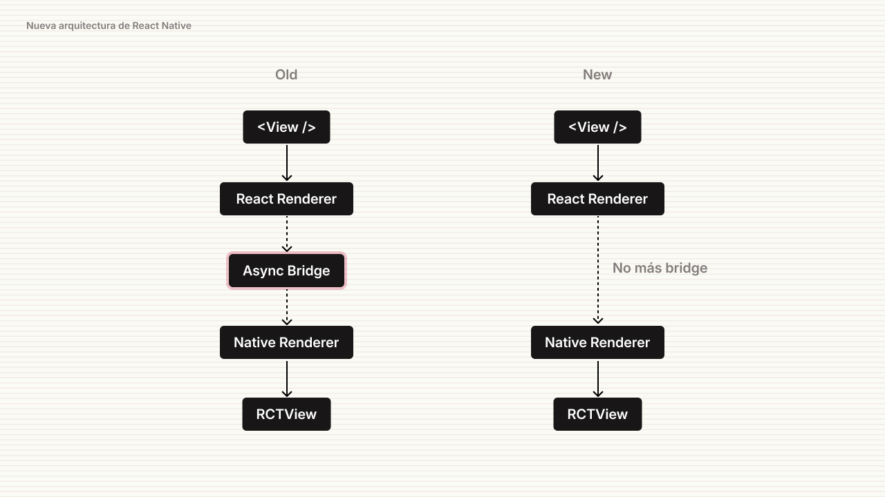

import Quote from '@/components/Quote.astro';
import Callout from '@/components/Callout.astro';
import ModalSheetExampleVideo from './modal-sheet-react-native.mp4';

Durante 2023, mi esposa y yo buscamos emprender un nuevo negocio en la Ciudad de México y, de frente con ese objetivo, necesitábamos algo que nos ayudara a llevar una buena gestión desde el primer día en que el negocio funcionara. Por ello, nos dimos a la tarea de analizar algunas alternativas existentes en el mercado para gestionar el negocio.

En este artículo, buscaré contarte mi experiencia trabajando con React Native, algunas consideraciones clave que debes tener en cuenta y algunos consejos prácticos para aprovecharlo al máximo.

## Sobre el negocio y decisiones

El negocio que buscamos emprender es el de una academia de baile, en la que ofrecemos clases de baile sobre ritmos latinos. En este sentido, los alumnos pueden acceder a diferentes tipos de paquetes de baile y asistir a clases en diferentes horarios.

Para ello, necesitábamos algún tipo de sistema que nos ayudara a gestionar las clases, la información de los alumnos, los pagos y la asistencia a las clases. Sin embargo, nos percatamos de que ninguna aplicación existente en el mercado lo hace de buena forma.

Y hay algo que siempre debes tomar en cuenta si vas a adquirir un software que ya está definido:

<Quote
  content="El software se debe poder adaptar al negocio y no el negocio al software"
  author="Principios del software"
  jobTitle="@coderdiaz"
/>

Esto es algo muy importante que debes considerar, ya que si posteriormente quieres ir en una dirección diferente, el software no te lo permitirá o te costará mucho trabajo. Esto, ocasionalmente, ocurre muy a menudo con los sistemas que no son a medida o que solo buscan adaptarse a tu negocio, provocando que cientos de empresas se queden ahí por el riesgo y el tiempo que implica cambiar de sistema.

## Por qué React Native

Algo que buscábamos desde un principio era ofrecer una experiencia sencilla y rápida para nuestros instructores, algo que simplemente pudieras hacer muy rápido y sin tantas complicaciones. Para poder lograr algo de este estilo, necesitábamos algo que nos ayudara a construir muy rápido, sin tantas configuraciones y sin tanta curva de aprendizaje.

<Callout class="bg-rose-50 text-rose-800 border-rose-500/30">
  <div class="flex flex-col gap-1">
    <p class="font-bold">¿Qué es React Native?</p>
    <p>Es un herramienta que permite desarrollar aplicaciones móviles nativas compartiendo funcionalidad en diferentes plataformas tales como Android y iOS escribiendo código una sola vez.</p>
  </div>
</Callout>

Antes de decidirnos por React Native, analizamos otras alternativas como Flutter o incluso desarrollarla de forma nativa con Swift. Sin embargo, cada una de ellas tiene sus desventajas, como toda herramienta existente. Por ejemplo, con Flutter, la curva de aprendizaje es bastante alta y esto implicaba no solo aprender las características de Flutter, sino también Dart, el lenguaje de programación que utiliza.

Por otro lado, Swift, aunque es un lenguaje muy fácil de dominar, tiene sus implicaciones técnicas específicas al trabajar en esta plataforma. Además, a corto plazo buscábamos ofrecerla también en dispositivos Android, por lo que en esta circunstancia tendría que aprender Kotlin, lo cual provocaría que el tiempo se incrementara de forma considerable.

Yo no te voy a decir que React Native es la mejor de todas por todo lo anterior que he mencionado. Esta tecnología también posee sus desventajas, como por ejemplo cuando tienes la necesidad de hacer alguna funcionalidad o comportamiento nativo. Sin embargo, para nuestro caso concreto y por la experiencia que tengo en React, era la mejor opción para nosotros.

## React Native, ¿cómo Bare o con Expo?

Si recientemente estás incursionando en esto, te habrás dado cuenta de que hay dos maneras de crear un proyecto con React Native: una es utilizándolo de forma "Bare" y la otra con Expo.

<Callout class="bg-rose-50 text-rose-800 border-rose-500/30">
  <div class="flex flex-col gap-1">
    <p class="font-bold">Versión Bare</p>
    <p>Es un tipo de configuración de proyecto que permite tener un control total sobre el código nativo. Este es ideal para desarrolladores que necesitan características avanzadas o personalizadas.</p>
  </div>
</Callout>

En la mayoría de los casos, `Expo` es la mejor opción para iniciar, a diferencia de un proyecto `Bare`, que posee muchas configuraciones y dependencias ya abstraídas para que solo te concentres en hacer que la aplicación funcione y no en configurarla. Sin embargo, si necesitas alguna funcionalidad nativa o algo que no esté soportado por Expo, entonces deberás optar por un proyecto `Bare`.

Si decides trabajar con Expo, es casi seguro que en alguna circunstancia, debido a que las dependencias se compilan con su propio servicio de construcción, dependerás de ello. Por lo que si esto no es lo que buscas, tendrás que optar por la versión `Bare`, ya que solo necesitarás de Xcode o Android Studio para compilar tu aplicación.

## Herramientas y librerías

El ecosistema de React Native ha crecido con los años y la comunidad se ha encargado de crear herramientas y librerías que nos ayudan a construir aplicaciones de forma más rápida y sencilla. No hay una fórmula perfecta para esto, pero sí te puedo recomendar algunas que me ayudaron mucho a sobrellevarlo.

1. **React Navigation**: Es una librería que nos ayuda a gestionar la navegación en nuestra aplicación. Es muy sencilla de utilizar y posee una gran documentación. Aunque si estás trabajando con `Expo`, esta ya la posee o también tienes la opción de utilizar `Expo Router`.
2. **Tamagui**: Es una librería que nos ayuda a construir interfaces de usuario de forma rápida y sencilla. Es muy similar a `TailwindCSS`, pero para React Native.
3. **Nativewind**: Para los amantes de `TailwindCSS`, esta librería nos ayuda a estilizar tus componentes en React Native utilizando todo el potencial de las clases que ofrece, para no tener que escribir tanto CSS.
4. **React Native Reusables**: Es un set de componentes construidos sobre React Native, al puro estilo de Shadcn/UI.
5. **React Native Bottom Tabs**: Esta librería es relativamente nueva y lo que busca es ayudarte a tener navegación a través de pestañas en la parte inferior de tu aplicación con el estilo correcto tanto para iOS como para Android.

## Consideraciones

Como mencioné en la sección de los tipos de proyectos que hay, si estás trabajando con Expo, hay algunas librerías que no podrás utilizar debido a que no están soportadas. Por lo que si decides trabajar con Expo, te recomiendo que revises la documentación de las librerías que necesitas para saber si son compatibles.

También, anteriormente era imposible compilar una aplicación de Expo sin la necesidad de utilizar los servicios en la nube de Expo. Sin embargo, desde la versión 49 de Expo, ya es posible compilar tu aplicación sin la necesidad de utilizar sus servicios en la nube.

## El martirio de Cocoapods y Ruby

Lo primero que debes saber es que si estás trabajando con un proyecto `Bare`, es muy probable que en algún momento necesitarás utilizar `Cocoapods` para instalar alguna dependencia cuando trabajas con iOS. Sin embargo, `Cocoapods` es una herramienta que se instala con `Ruby`, y aquí es donde se complica un poco.

Durante mi experiencia, me di cuenta de que generalmente no utilizamos la versión de Ruby que viene por defecto en el sistema de macOS, ya que esta versión es muy antigua y se requiere para funcionalidades internas del propio sistema operativo. Por lo que para evitar problemas, te recomiendo que utilices algún gestor de versiones de Ruby como `RVM` o `RBENV` para evitar problemas con las versiones.

También, puedes optar por instalarlo a través de `Homebrew`:

```bash
brew install ruby
```

Una vez que hayas realizado la instalación, te recomiendo que utilices este snippet para actualizar el `PATH` de tu terminal para que cargue la versión de Ruby que acabas de instalar:

```bash
if [ -d "/opt/homebrew/opt/ruby/bin" ]; then
  export PATH=/opt/homebrew/opt/ruby/bin:$PATH
  export PATH=`gem environment gemdir`/bin:$PATH
fi
```

Con esto, evitarás muchos problemas que puedan surgir al momento de administrar las dependencias de tu proyecto.

## La experiencia

En general, trabajar con React Native es como estar construyendo un sitio web, pero con la diferencia de que tienes que utilizar los componentes incluidos, que no son HTML, sino que son componentes de React Native que se compilan a elementos nativos del sistema operativo.

Además, cuando necesitas hacer comportamientos nuevos o diferentes, es muy fácil hacerlo, ya que la misma plataforma te guía fácilmente, como por ejemplo este `Sheet` que se despliega desde la parte inferior de la pantalla:

<figure class="flex flex-col gap-4 not-prose md:-mx-10 my-6 md:mt-12">
  <div class="h-auto w-full">
    <video class="m-auto rounded-lg bg-background" loop controls autoplay src={ModalSheetExampleVideo} />
  </div>
  <figcaption class="block font-medim text-sm text-tones-500 text-center w-full">
    Fig 1. Ejemplo de un `Sheet` creado desde cero en React Native
  </figcaption>
</figure>

Sin embargo, cuando buscas utilizar componentes nativos del sistema para hacer alguna funcionalidad, aquí es donde se llega a complejizar un poco, ya que tendrás que utilizar `NativeModules` para poder acceder a ellos y esto implica que tendrás que escribir código nativo, ya sea en Kotlin o en Swift, por lo que procura aprender un poco.

Actualmente, la forma en la que se construían componentes que se comunican con lo nativo del sistema operativo ha cambiado con la última versión, donde quitaron el `Bridge` que se utilizaba para acceder a las funcionalidades nativas de forma asíncrona.

<figure class="flex flex-col gap-4 not-prose md:-mx-10 my-6 md:mt-12">
  <div class="relative">
    
  </div>
  <figcaption class="block font-medim text-sm text-tones-500 text-center w-full">
    Fig 2. Nueva arquitectura de React Native para acceder a funcionalidades nativas
  </figcaption>
</figure>

Ahora, con estos nuevos cambios en la nueva arquitectura, podremos acceder a las funcionalidades nativas de una forma síncrona, y que además brinda beneficios al tiempo de compilar la aplicación sobre su rendimiento.

## En conclusión

Te recomiendo trabajar con React Native, si tienes un background en desarrollo web y si ya has trabajado previamente con React, ya que la curva de aprendizaje es muy baja y podrás construir aplicaciones de forma rápida y sencilla.

Sin embargo, es muy importante preguntarte sobre las características peculiares de la aplicación que vas a desarrollar. Por ejemplo, si es algo que requiere hacer uso de funcionalidades nativas, tales como GPS u otras interacciones más específicas del sistema operativo, es preferible que optes por una aplicación nativa.

Aunque hoy en día las aplicaciones híbridas van muy bien y son muy utilizadas, no todas las aplicaciones son aptas para ser construidas con React Native, por lo que es muy importante que hagas un análisis previo antes de decidirte por esta tecnología.

Espero que este pequeño análisis te haya ayudado, y si es así, me gustaría escuchar tu opinión al respecto.

Muchas gracias por leer.