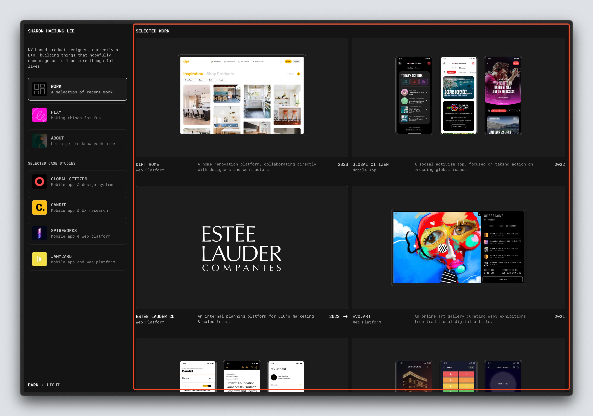
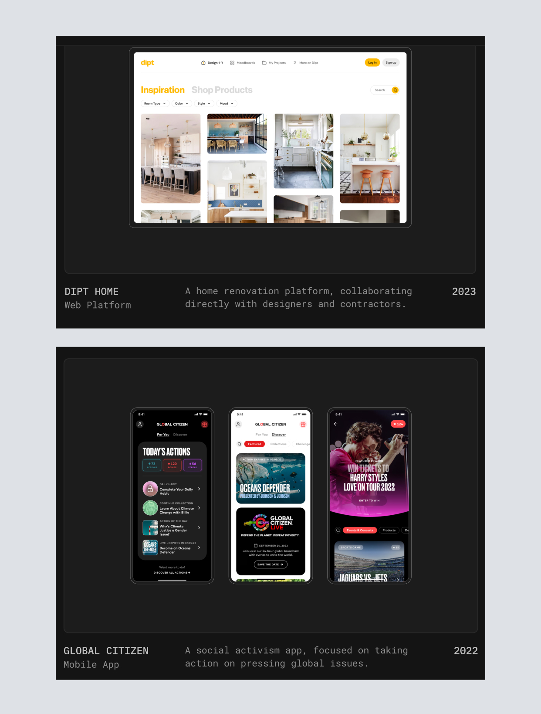
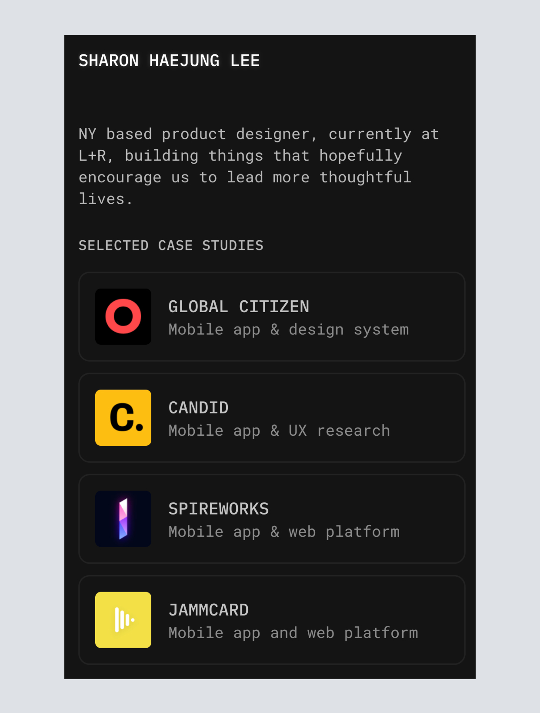
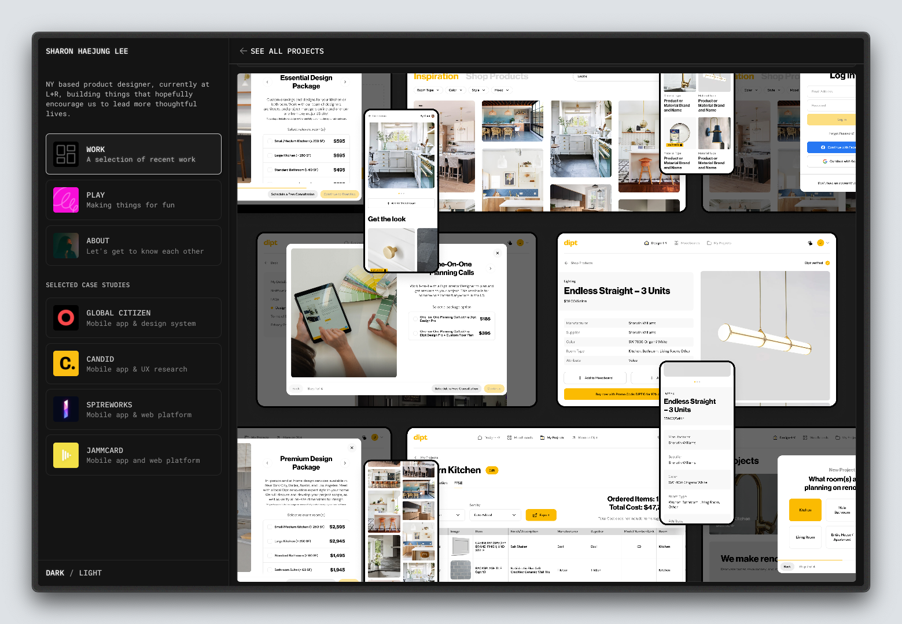
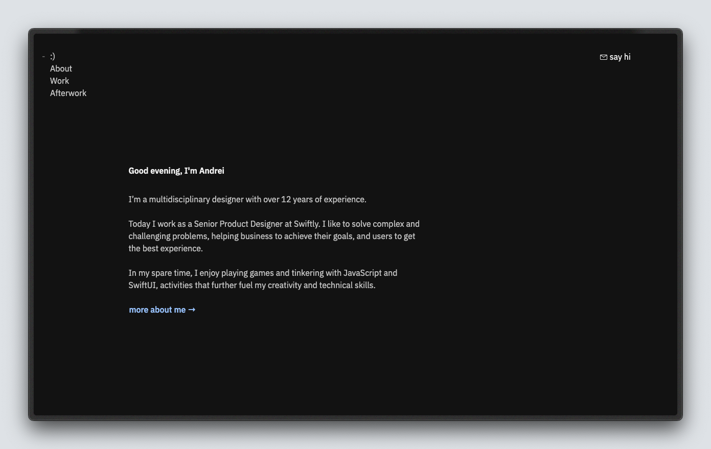
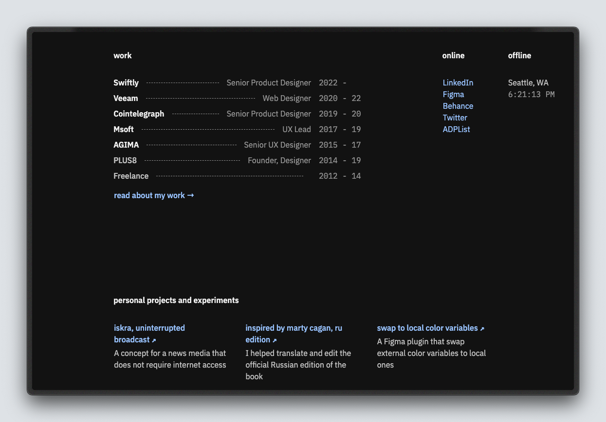

import Separator from '@/components/Separator.astro';
import Callout from '@/components/Callout.astro';

Hoy en día la presencia en línea es fundamental para cualquier profesional que busca mostrar su experiencia y habilidades. Sin embargo, elegir entre crear un portafolio o un sitio web personal puede ser algo que te estes preguntando en este momento. En este artículo, exploraremos las diferencias entre estás dos opciones para que tu mismo puedas decidir cuál es la mejor opción para ti.

<Callout>
  Si estás buscando crear tu sitio web pero no sabes por donde empezar, no te preocupes, aquí te dejo una plantilla en figma **totalmente gratis** para que puedas comenzar a construirlo ahora.

  <a href="https://www.figma.com/community/file/1392320620675687904/simple-personal-portfolio-for-personal-use" rel="noreferrer" class="bg-accent-1000 flex items-center justify-center w-full md:w-max px-4 py-2 rounded-lg text-accent-100">Descargar plantilla en Figma</a>
</Callout>

## ¿Qué es un portafolio?

Un portafolio es una espacio donde puedes organizar trabajos y proyectos que muestran tus habilidades, experiencias y logros que has concretado. Generalmente, se utilizan por profesionales creativos como diseñadores, fotógrafos, y artistas para presentar su trabajo de una forma visualmente atractiva.

La parte esencial de estos es que se enfocan en mostrar tu trabajo de manerá más visual, su principal objetivo es endulzar el ojo del visitante y hacer que se sienta atraído por lo que haces.

### Características de un portafolio

- Visualmente enfocado en mostrar trabajos y proyectos.
- Incluye ejemplos detallados de tu trabajo.
- Puede incluir testimonios y casos de estudio.

Vamos a analizar un ejemplo para que nos quede un poco más claro, el portafolio que vamos a revisar pertenece a **Sharon Lee**, una diseñadora de producto.

Como podemos ver al entrar a su sitio web, lo primero que nos podremos encontrar es una galeria de sus proyectos seleccionados que ha realizado. Cada proyecto tiene una descripción detallada de lo que se trata y una imagen que muestra el resultado final.

<figure class="flex flex-col gap-4 not-prose md:-mx-10 my-6 md:mt-12">
  

    
  

  <figcaption class="block font-medim text-sm text-tones-500 text-center w-full">
    Fig 1. Portafolio de Sharon Lee
  </figcaption>
</figure>

  

    <figure class="flex flex-col gap-4">
      

        
      

      <figcaption class="block font-medim text-sm text-tones-500 text-center w-full">
        Fig 2. Detalles de un proyecto
      </figcaption>
    </figure>
    <figure class="flex flex-col gap-4">
      

        
      

      <figcaption class="block font-medim text-sm text-tones-500 text-center w-full">
        Fig 3. Proyectos más destacados a plena vista
      </figcaption>
    </figure>
  

Es importante destacar nuestro principal trabajo, aquellos que hayan destacado de los demás para que quién visite tu sitio se concentre en lo que realmente destaca tus habilidades.

<figure class="flex flex-col gap-4 not-prose md:-mx-10 my-6 md:mt-12">
  

    
  

  <figcaption class="block font-medim text-sm text-tones-500 text-center w-full">
    Fig 4. Pantalla de un proyecto
  </figcaption>
</figure>

### Ventajas de un portafolio

Dentro de las ventajas que podemos encontrar al hacer un portafolio son:
- Proporciona una forma visualmente atractiva de mostrar tus habilidades.
- Facilita la demostración de tu experiencia y logros.
- Brinda interacción con tus visitantes a través de testimonios y casos de estudio.

<Separator />

## ¿Qué es un sitio web personal?

A diferencia de un portafolio, un sitio web personal te representa a ti como persona individual y puede incluir variedad de información. Puede servir para múltiples propositos como un blog, un CV en línea, darte a conocer como profesional, compartir tu experiencia laboral y carrera, entre otros fínes.

### Características de un sitio web personal
- Es mucho más versátil y puede incluir diferentes tipos de contenido (blog, cv, proyectos, información de contacto, etc).
- Permite una presentación más completa de ti mismo.
- Aunque puedes incluir los proyectos que haz trabajado, se enfocan menos visualmente.

Pero para lograr entender como se ve un sitio web personal, vamos a revisar el sitio web de `Andrei`, un ingeniero enfocado en el frontend.

<figure class="flex flex-col gap-4 not-prose md:-mx-10 my-6 md:mt-12">
  

    
  

  <figcaption class="block font-medim text-sm text-tones-500 text-center w-full">
    Fig 5. Sitio web de Andrei
  </figcaption>
</figure>

Lo primero que podemos destacar en este tipos de sitios web, es que son muy sencillos, pero super completos. Aunque esto no debe limitar tu creatividad al crearlo, ya que aunque no se enfoca en mostrar algo visualmente, puedes hacerlo de otra manera.

<figure class="flex flex-col gap-4 not-prose md:-mx-10 my-6 md:mt-12">
  

    
  

  <figcaption class="block font-medim text-sm text-tones-500 text-center w-full">
    Fig 6. Experiencia y proyectos
  </figcaption>
</figure>

Estos sitios web buscan una conexión más personal con quienes buscan conocer un poco más de la persona detrás de los proyectos. Se puede ver a simple vista los proyectos y empresas en las que ha trabajado y generalmente funciona muy bien para quienes se dedican a desarrollar software open-source ya que pueden mostrar sus contribuciones.

Además, de que al ser un sitio personal, puedes utilizarlo como blog y crear contenido, experiencias o tutoriales que puedan ser de interés para otros.

### Ventajas de un sitio web personal
- Brinda mayor flexibilidad para incluir información diversa.
- Ideal para mostrar tu personalidad y experiencia.
- Puedes incluir un blog y compartir contenido de interés.

<Separator />

## ¿Cuál es la mejor opción para ti?

Si eres un profesional creativo que necesita mostrar su trabajo de forma muy visual, un portafolio es la mejor opción. Sin embargo, si lo que buscas es mostrar una presentación más completa de ti mismo, un sitio web personal sería lo más adecuado.

## Conclusión

La elección entre un portafolio o un sitio web personal dependerá de tus necesidades concretas y el objetivo de lo que buscas hacer. Ambos cumplen sus propósitos y pueden ser una excelente manera de generar una presencia en línea. Recuerda que lo más importante es que te sientas cómodo con lo que estás mostrando y que refleje tu personalidad y habilidades.

¿Estás buscando crear tu sitio web o portafolio pero no sabes por donde empezar? No te preocupes te puedo ofrecer mis [servicios](/servicios/) para ayudarte a crear tu presencia en línea creando un diseño adecuado para ti.

Espero haberte ayudado y con esto puedas dar inicio y crear tu sitio web. ¡Buena suerte! Muchas gracias por leer.