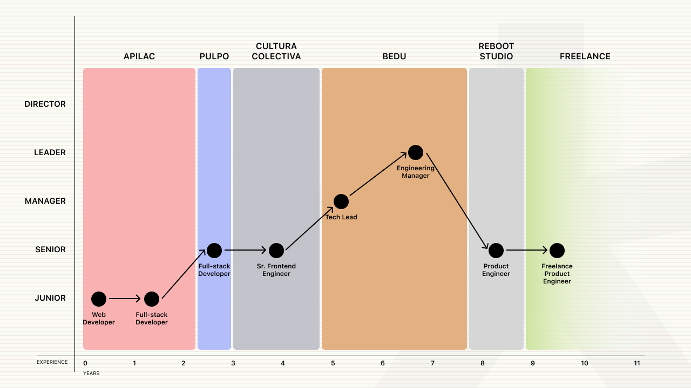

import Quote from '@/components/Quote.astro';
import Separator from '@/components/Separator.astro';

Durante los más de 9 años que llevo de mi carrera, me ha tocado ser parte de diferentes equipos de trabajo, algunos de ellos muy top y he aprendido mucho de ellos. Las experiencias han sido muy variadas y también los nichos en los que se desarrollan, pero eso ha hecho que mi perspectiva de como se ven y se deben hacer las cosas en la índustria haya cambiado.

En este post, no busco hacer que te preguntes si estás en el lugar correcto o si estás haciendo lo correcto, ni mucho menos que te haga preguntarte: **¿Por qué me ha tomado demasiado subir a un puesto más alto?**, **¿Comó es que llevo más de 4 años y sigo sin llegar a Senior?**. Lo que busco es que te des cuenta que el progreso no siempre es hacia arriba:

<Quote
  content="A veces avanzamos y otras retrocedemos, pero lo importante es seguir adelante."
  author="Javier Diaz @coderdiaz"
  jobTitle="Así es, el progreso no es lineal."
/>

## El inicio de mi carrera

Mi carrera profesional comenzó por ahí del 2015, tuve la dicha de poder comenzar a trabajar incluso antes de haber terminado la carrera de ingeniería en sistemas. Y digo dicha, por que no todos podemos gozar de esa oportunidad, debemos ser agradecidos con las oportunidades que nos llegan y sobre todo aprovecharlas al máximo.

Nota muy importante, cuando se es joven te quieres comer el mundo, quieres lograr todo y ser el próximo Mark Zuckerberg, pero la realidad es otra cuando te enfrentas a ella. Si estás en tus 20's y te sientes frustrado por no haber logrado lo que te propusiste, no te preocupes, tu meta principal debe ser seguir y aprender de los que ya llevan tiempo en tu nicho.

Eso apalancara tu carrera y te hará madurar profesionalmente, y si, madurar es distinto de crecer. Todos podemos crecer y hacernos buenos en lo que hacemos, pero madurar y comprender que no todo pinta como parece es muy distinto. Y te lo contaré con una experiencia.

## Mi primer startup

Durante el 2017, decidí emprender un viaje y moverme a la Ciudad de México, para ese entonces tenía 25 años y estaba muy emocionado por lo nuevo que se vendría. Yo venía con la cabeza en alto y dominando muchas herramientas de desarrollo, me sentía poderoso. Sin embargo, cuando llegue a la ciudad y conocí a mi equipo me di cuenta que no era tan bueno como pensaba.

Fue un balde de agua fría para mi, primero por que mis nuevos compañeros eran muy buenos, y segundo, por que en ese momento sentí que no estaba a la altura.

Facilmente uno como humano, puede sentir miedo y desanimarse, por que somo humanos y sentimos. Pero madurar es entender y aprender de las experiencias y aprovechar para crecer. Y eso fue lo que hice, aprendí de ellos, me esforcé y logré ser parte de un equipo muy bueno.

## El cambio de nicho

Dejar la zona de comfort, también demuestra crecimiento, sin embargo, no siempre debe ser así. Cada persona vive su vida de manera distinta y no todos tenemos las mismas prioridades. Quedarte en un lugar de trabajo por mucho tiempo no es malo, siempre y cuando te sientas cómodo y continues aprendiendo.

Pero también, tienen su contra, puedes perder la oportunidad de experimentar nuevas perspectivas y de poner a prueba tus habilidades con elementos diferentes. Aveces nos volvemos expertos en algo que no nos damos cuenta que ya dominamos todo donde nos encontramos y eso nos puede limitar a crecer. Nuevamente recalco, cada persona es distinta y vive su vida a su manera, y no siempre es así en todos los lugares.

## Un salto de fe

Para 2020, conocí a una nueva persona gracias a un amigo con el que trabajaba en ese entonces, y esta persona decide darme la oportunidad de crear algo completamente desde cero, con el objetivo de ser el **líder técnico** de un equipo de 4 personas.

Lo llamo un salto de fe, por que así es como ocurren a veces las cosas, pueden llegar por una promoción, por un nuevo empleo, o por una oportunidad que se presenta. Y en ese momento, no sabía si estaba listo para liderar un equipo, pero nunca iba a saberlo sin intentarlo. Ya contaba con suficiente experiencia para tomar decisiones técnicas, construir proyectos e involucrarme con el negocio para entender las necesidades de los usuarios. Pero liderar un equipo es todo un tema.

Para este punto, no solo debes dominar habilidades técnicas (o duras, como también se les conoce), si no también **habilidades blandas** como la comunicación, la empatía, la resolución de conflictos, la toma de decisiones y la gestión del tiempo.

Durante mi estancia aquí, me involucré al 100% con el equipo, aprendí de ellos, y juntos logramos crear un producto que fue muy bien recibido por los usuarios.

## El resultado

Debido a todo esto, decidieron promoverme a un puesto de líder, espera... pero anteriormente eras líder, ¿cuál es la diferencia?, bueno, es que ser manager no necesariamente te permite tomar decisiones de hacía donde dirigir el negocio, si no que te permite ejecutar esas decisiones de buena forma a con el negocio.

Me promovieron a Engineering Manager, y aquí me di cuenta de muchas cosas. Primero, tener un puesto de liderazgo no significa que eres el mejor de todos, si no que eres el que sabe tomar mejores decisiones para el equipo y el negocio con base en los resultados que haz demostrado.

Sin embargo, esto te puede poner en jaque, por que las decisiones que tomes aquí afectan el rumbo del negocio y el bienestar de tu equipo. Y eso es algo que no todos pueden manejar. Afortunadamente, en ese punto teníamos un VP de Ingeniería, del cuál aprendí mucho y me ayudó a encaminarme.

Obviamente me equivoque muchas veces, pero eso es parte de crecer, de aprender y de madurar. Y eso es lo que me ha llevado a donde estoy ahora.

<figure class="flex flex-col gap-4 not-prose md:-mx-20 my-6 md:my-12">
  

    
  

  <figcaption class="block font-medim text-sm text-tones-500 text-center w-full">Fig 1. Progreso actual de mi carrera</figcaption>
</figure>

## En retroceso

Darse cuenta que aún hay cosas que aprender, cosas que mejorar y cosas que cambiar, te permiten decidir volver un paso atrás para poder avanzar dos adelante. Y eso fue lo que hice, decidí dejar mi puesto de Engineering Manager para poder enfocarme en mejorar mis habilidades de comunicación, liderazgo, negocio y producto.

Y asi fue como llegue a un estudio de producto con sede en Barcelona, donde aprendí mucho de diseño, como construir un producto enfocado en los usuarios y como trabajar en un equipo con diferente cultura, formas de pensar y perspectivas.

Así que, no te sientas mal por volver atrás, por que eso te permitirá avanzar más adelante. Después, lastimosamente me ocurrio un problema de salud que me obligó a dejar este trabajo, pero eso es otra historia.

<Separator />

Hoy en día, me dedico a trabajar como freelance haciendo diseño de productos digitales y desarrollando software, cosas que me encanta hacer. Y aunque no siempre es fácil, me siento agradecido por las oportunidades que he tenido y por las personas que he conocido en el camino.

Si conoces a alguien que busca un diseñador de productos digitales o un desarrollador de software, no dudes en ponerlo en contacto conmigo. Estoy seguro de que podré ayudar a hacer cosas increíbles.

Muchas gracias por leer.