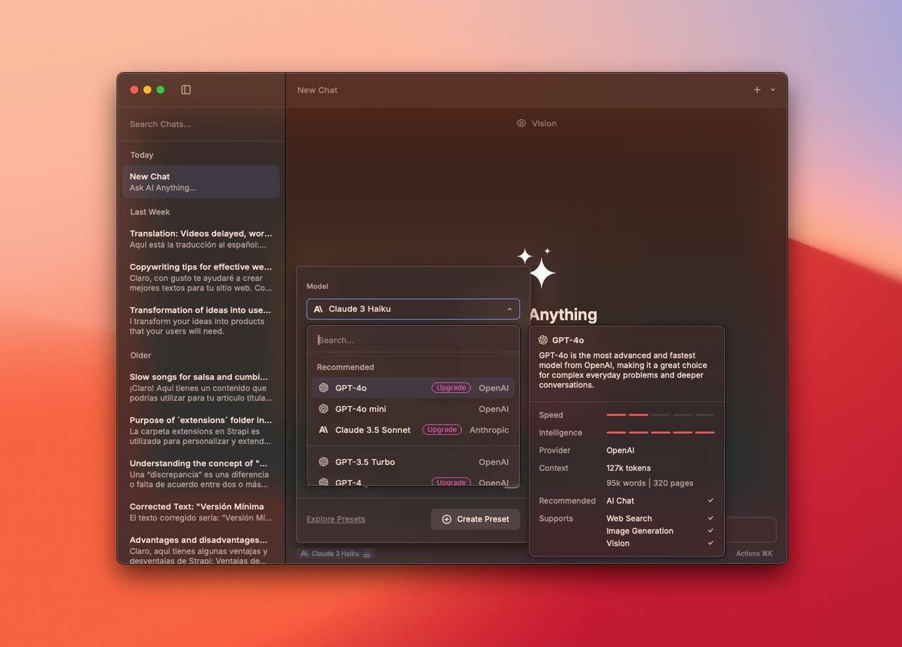

import Callout from '@/components/Callout.astro';
import Separator from '@/components/Separator.astro';

Durante los años que llevo trabajando como desarrollador web, me he encontrado con infinidad de herramientas en internet para facilitar mi trabajo. Algunas de ellas me han ayudado a ser más productivo y, por tanto, se han convertido en herramientas imprescindibles en mi día a día.

En este artículo, te comparto mis herramientas favoritas que no pueden faltar para hacer mi trabajo más fácil y divertido.

<Callout>
  Nota: Algunas herramientas solo están disponibles para el sistema operativo macOS que es el que yo utilizo en mi día a día.
</Callout>

## 1. Raycast

Desde hace aproximadamente 4 años que descubrí Raycast, y se ha convertido en una herramienta que no puede faltar en mi equipo de trabajo. Raycast es una herramienta que te permite acceder a tus aplicaciones y servicios favoritos con tan solo presionar una combinación de teclas.

También, puedes crear scripts para automatizar tareas repetitivas e instalar extensiones para integrar tus apps favoritas como Notion, Jira, Trello, entre otras.

Además, incluye en su versión Pro, acceso a una herramienta avanzada para crear tu propio administrador de ventanas que te permitirá organizar tus aplicaciones en diferentes escritorios virtuales y a herramientas de IA (Inteligencia Artificial) con diferentes servicios como OpenAI, Llama de Meta, Claude, entre otros.

Dentro de las extensiones que yo utilizo están:
- **Color Picker**, el cuál me permite inspeccionar colores.
- **Docker**, para gestionar todo lo correspondiente a contenedores desde el teclado.
- **Kill Process**, útil para matar procesos.
- **Toothpick**, necesario para administrar dispositivos conectados por Bluetooth.

## 2. Pixel Snap

¿Cuántas veces has tenido que comprobar que los elementos estén posicionados donde deben estar y que tengan el tamaño correcto?, Pixel Snap te permitirá dibujar guías en tu pantalla para que puedas alinear tus elementos de forma precisa.

Con esta herramienta podrás medir distancias, alinear elementos, y verificar que todo este en su lugar. Posee diferentes atajos de teclado para activar y desactivar las guías, cambiar el color de las mismas, y otras opciones.

Esta aplicación no puede faltar si trabajas en diseño web o desarrollo de interfaces, o siendo frontend developer.

## 3. Shottr

Aunque generalmente los sistemas operativos poseen de herramientas para tomar capturas de pantalla, Shottr es una herramienta que te permitirá tomar capturas de pantalla de forma rápida y sencilla, y con diferentes caracteristicas para personalizar tus capturas.

Algunas de sus caracterisiticas son:

- Tomar capturas de pantalla con Scroll.
- Pixelar áreas sensibles.
- Reconocimiento de texto en capturas.
- Agregar notas y elementos visuales.
- Reglas y guías para medir distancias.
- Seleccionar colores.

Cuando quieres compatir feedback con tu equipo, o con tus clientes, con esta herramienta lo podrás hacer muy rápido sin depender de otro software de edición para agregar detalles que enriquezcan la información.

## 4. Lungo

Esta herramienta es muy útil para evitar que tu Mac se duerma o entre en modo reposo, algo que personalmente no me gusta cuando estoy trabajando y no quiero que mi equipo se apague.

Lungo te permitirá mantener tu Mac despierto por el tiempo que tú decidas para que puedas mantenerte concentrado en lo que estás trabajando.

Desafortunadamente, esto no está disponible de forma nativa en macOS y es necesario instalar una aplicación de terceros para poder hacerlo.

## 5. Dropover

Si alguna vez has tenido que tener abiertas muchas carpetas para mover archivos de un lugar a otro y has sufrido en esas circunstancias, esta herramienta te va a encantar, ya que es una de mis favoritas.

Con Dropover podrás arrastrar y soltar archivos en una ventana flotante que se mantendrá en la parte superior de todas las ventanas abiertas, y así podrás mover tus archivos de un lugar a otro sin tener que tener abiertas todas las carpetas, y puedes tener tantas instancias como necesites.

Además, puedes crear acciones personalizadas para mover archivos a carpetas específicas, o enviar archivos por correo electrónico, entre otras opciones que pueden ayudar a mejorar tu flujo de trabajo.

También, en su versión PRO, puedes acceder a contenedores en línea para compartirlo entre diferentes dispositivos y sincronizar tus archivos de una forma muy sencilla.

## 6. TablePlus

Aunque he de reconocer que hay muchas herramientas para gestionar bases de datos, TablePlus es una de las que me atraparon para trabajar con bases de datos de forma rápida y sencilla.

Anteriormente, trabajé utilizando Postico que también tiene lo suyo pero solo funciona para bases de datos PostgreSQL y no tiene tantas opciones como TablePlus.

Con esta aplicación podrás conectarte a diferentes motores de bases de datos, tales como:

- SQL Server.
- PostgreSQL.
- MariaDB.
- MySQL.
- Y muchas más...

Además, podrás ejecutar consultas SQL, ver la estructura de tus tablas, importar y exportar datos, y muchas otras opciones que te permitirán trabajar de forma más eficiente.

## 7. Zed Editor

Si aún no has escuchado de Zed Editor, te estás perdiendo de una herramienta poderosísima y que puede ser el próximo competidor directo de Visual Studio Code.

Zed es un editor de código que te permite trabajar con diferentes lenguajes de programación y que se encuentra actualmente en desarrollo. Se caracteriza por que su enfoque es crear el editor más rápido y eficiente para programadores.

Actualmente, se encuentra en constante desarrollo y se puede instalar en macOS, y recientemente liberaron para utilizarlo en Linux, así que si no lo has probado aún te invito a echarle un vistazo.

Yo lo utilizo para trabajar con lenguajes como Go y JavaScript, y me ha resultado muy útil para trabajar en proyectos personales. Sin embargo, aún no he migrado por completo a este editor ya que actualmente no cuenta con una interfaz para gestionar commits de Git, algo que es fundamental para mi flujo de trabajo.

Pero eso no significa que le reste méritos, ya que aunque Visual Studio Code posee muchas características actualmente debido a eso se está convirtiendo en un editor muy pesado y lento.

<Separator />

Como he mencionado, estas herramientas me han ayudado a ser más productivo y disfrutar de una mejor experiencia trabajando en mis proyectos. Aunque algunas de ellas son de pago, considero que la inversión vale la pena.

Espero que estas herramientas te sean de utilidad y te ayuden a mejorar tu flujo de trabajo. Nos vemos pronto en el siguiente artículo.

¡Muchas gracias por leer!