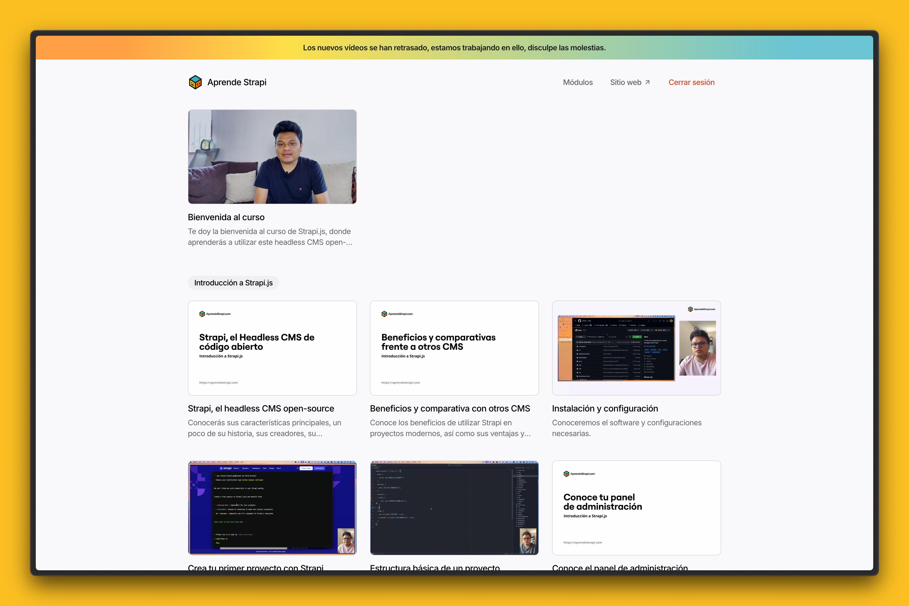
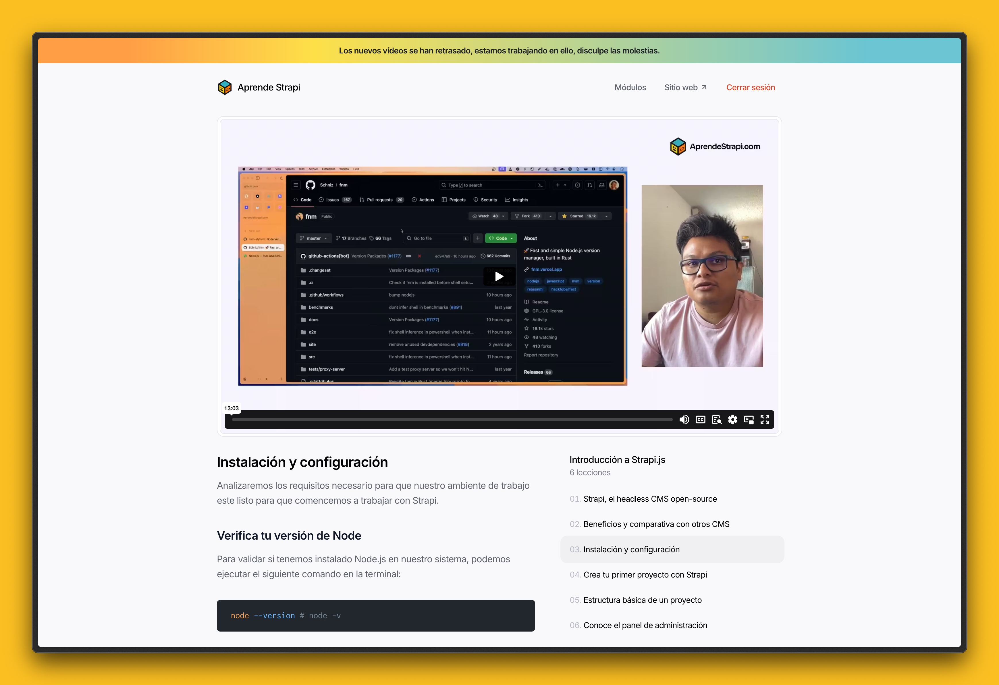
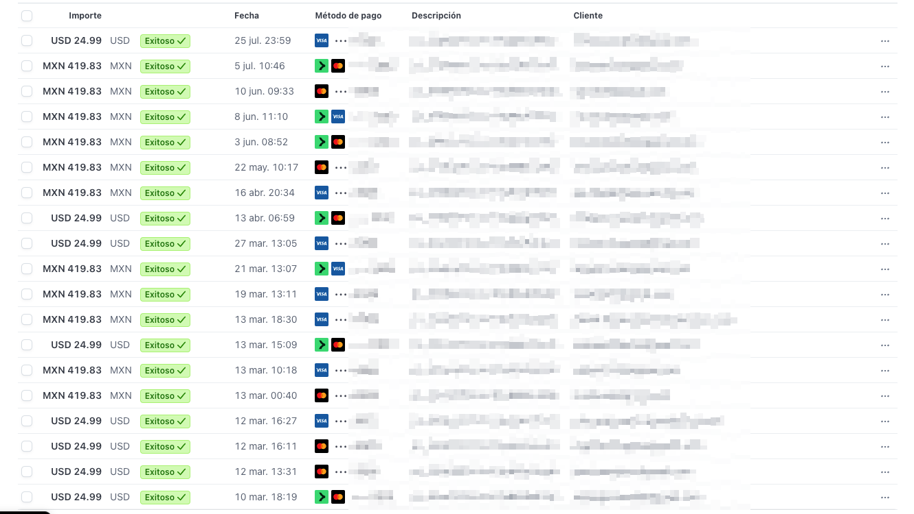
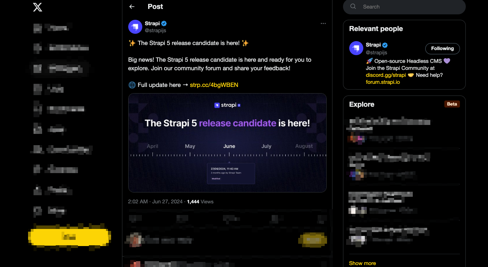

import Callout from '@/components/Callout.astro';
import Separator from '@/components/Separator.astro';

Si alguna vez te dijeron "Oye, ¿por qué no has lanzado un curso si sabes tanto de X tema?" y un día simplemente decidiste que sí, te habrás dado cuenta de que no es tan fácil como parece.

En este artículo te compartiré un poco de mi experiencia lanzando mi primer curso en línea desde cero y todo lo que he aprendido en el proceso.

<Callout>
  (TL;DR). El curso ha sido pospuesto para __Marzo de 2025__ debido a problemas de edición, casos excepcionales (enfermedad) y al lanzamiento de la nueva versión de la herramienta.
</Callout>

## El inicio
Lo primero que debo contarte es que la preparación es súper fundamental, es decir, es el pilar sobre el cual se va a sostener todo tu curso de inicio a fin. Si este no tiene una buena preparación, es muy probable que durante la grabación del curso te encuentres con problemas que no tenías previstos o que estabas pasando por alto.

Dediqué aproximadamente 2 meses a la preparación del contenido del curso, es decir, investigar, leer, practicar y preparar el contenido que iba a enseñar. En este tiempo también me dediqué a preparar el material que iba a utilizar durante el curso, como presentaciones, ejercicios, etc.

Si bien hay mucho contenido en internet, la mayoría de este se centra en las particularidades o bases del mismo y casi nadie toca las entrañas o elementos que son peculiarmente interesantes para quienes quieren ir más allá con la herramienta, y es ahí donde debes enfocarte, en lo que no se ha dicho, en lo que no se ha hecho.

Ese puede ser el gran diferenciador con respecto a otros cursos que ya existen en el mercado. Sin embargo, este no es el principal problema, es solo la punta del iceberg.

Porque ahora viene lo interesante: la grabación y consumo del curso. Donde los interesados en el curso podrán consumir y ver todo el contenido que has preparado, cuánto te va a costar y cuánto tiempo te va a llevar. ¿Sabes de edición? ¿Cuánto te tomará capacitarte en hacer algo muy sencillo pero que no sabes hacer?

## ¿Dónde lo van a ver? 🤯
Esta pregunta es la que me tomó un poco más de tiempo meditar para ofrecer la mejor experiencia de aprendizaje. Lo que sí tenía claro es que necesitaba algo muy sencillo de gestionar, algo en lo que simplemente pudiera ponerme a escribir y no preocuparme por la infraestructura o el diseño de la plataforma.

Incluso llegué a pensar en montarlo sobre Udemy, pero la verdad es que había que esperar a una valoración de ellos y no quería esperar; quería lanzarlo lo más pronto posible y sin complicaciones. Además, el curso es muy largo y no se si iba a ser aceptado tal y como estaba planteado.

Por lo que simplemente decidí hacer algo muy sencillo: un proyecto con Next.js montado sobre MDX desde el servidor para asegurar el contenido y que solo quienes adquirieran el curso pudieran verlo. Los videos los cargué en Vimeo y solo están disponibles embebidos en ese dominio gracias a la API de Vimeo.

<figure class="flex flex-col gap-4 not-prose md:-mx-10 my-6 md:my-12">
  

    
  

  <figcaption class="block font-medim text-sm text-tones-500 text-center w-full">
    Fig 1. Así se ve la plataforma AprendeStrapi.com
  </figcaption>
</figure>

<figure class="flex flex-col gap-4 not-prose md:-mx-10 my-6 md:my-12">
  

    
  

  <figcaption class="block font-medim text-sm text-tones-500 text-center w-full">
    Fig 2. Detalle de una lección en AprendeStrapi.com
  </figcaption>
</figure>

Esto me tomó cerca de 2 semanas llevarlo a cabo y fue un proceso relativamente sencillo de hacer junto a varias herramientas que me permitieron acelerar su lanzamiento. Sinceramente, quedé muy feliz con el resultado.

## La grabación

Afortunadamente, tengo experiencia grabando contenido de este estilo y he tenido la oportunidad de colaborar con plataformas reconocidas de educación como Platzi, Códigofacilito, BEDU, entre otras. Por lo que no fue tan complicado para mí adaptarme al formato. Generalmente, me tomaba de 2 a 3 horas grabar entre 2 y 3 lecciones, y luego me dedicaba a editar el contenido, el cual sí tomaba un poco más de tiempo dependiendo del total de cortes y adecuaciones que hice durante la grabación.

No necesitaba realmente una cámara de mucha calidad, simplemente utilicé la cámara de mi iPhone 12 Pro, que es relativamente buena, y un foco de iluminación para que se viera de buena calidad y con un resultado muy profesional.

El resultado fue muy bueno y estoy feliz con ello.

## La promoción y venta

Para ser sincero, pensé que iba a ser un lanzamiento muy bueno, ya que, como mencioné al inicio, hay muy poco contenido en español bien hecho sobre esta herramienta y pensé que iba a ser un éxito rotundo, pero no fue así. Aún así, tuve el apoyo de algunos de mis seguidores que han confiado plenamente en mis proyectos e ideas, y eso me dio la iniciativa para hacerlo.

Lo que sí puedo decir es que con esto no obtengo ninguna ganancia en lo absoluto, pero sí me deja la oportunidad de que la plataforma se mantenga y pueda seguir atrayendo a más personas a aprender sobre Strapi, por lo menos un año.

<figure class="flex flex-col gap-4 not-prose md:-mx-10 my-6 md:my-12">
  

    
  

  <figcaption class="block font-medim text-sm text-tones-500 text-center w-full">
    Fig 3. Transacciones. Muchas gracias a quienes han confiado en el proyecto
  </figcaption>
</figure>

## Lo malo
Como no soy muy bueno editando videos, tuve que apoyarme en una persona que me ayudaría a editar el contenido, lo cual fue bien desde un inicio, pero poco después me _ghostearon_ (ya saben, la persona simplemente se esfumó y nunca volvió a responder), por lo que estuve prácticamente sin poder subir videos a la plataforma.

Esto, obviamente, no gustó a los primeros compradores del curso y tuve que estar dando detalles al respecto. Hasta ahora no he podido recuperar el ritmo de subida de contenido y me tiene bastante inconforme con la situación. Esto me ha hecho replantearme si debo seguir con el curso o simplemente dejarlo morir.

Pero frente a todo esto, he decidido continuar, pero con un nuevo enfoque y con todo un aprendizaje por delante para que esto no vuelva a suceder. Sin embargo, eso significa aplazarlo aún más.

## Mi enfermedad
Sí, aunque me duela tener que estarlo diciendo constantemente, este es un punto de inflexión en mi vida que me afecta y que debo siempre tener en cuenta. La enfermedad de Meniere que padezco me afecta de forma directa en mi día a día, por lo que no puedo estar al 100% en todo momento y eso siempre será un factor.

He aprendido mucho en este proceso, aprendí a ser más paciente, a ser más organizado, a ser más proactivo y a ser más constante. Aunque no haya sido un éxito rotundo, me ha dejado muchas enseñanzas que te compartiré más adelante.

## Lo inesperado

<figure class="flex flex-col gap-4 not-prose md:-mx-10 my-6 md:my-12">
  

    
  

  <figcaption class="block font-medim text-sm text-tones-500 text-center w-full">
    Fig 4. Se anuncia la versión RC de Strapi 5. Fuente: Cuenta de Strapi en X.
  </figcaption>
</figure>

Durante el inicio de la grabación, yo tenía previsto ganarle al lanzamiento de la nueva versión mayor de la herramienta, ya que en ese momento estaba la versión 4 de Strapi y la versión 5 todavía se encontraba en desarrollo. 

Sin embargo, de un momento para otro se lanzó la versión RC (Release Candidate) que iba a ser la sucesora de la versión 4 actual y, en definitiva, por lo menos con la experiencia que tengo trabajando con la herramienta.

Las personas se mueven muy rápido hacia las versiones nuevas en Strapi, es decir, dentro de poco a nadie le iba a interesar un curso de Strapi 4. Aquí en este mundo de Strapi, es muy diferente a otras herramientas, ya que el equipo de Strapi trabaja arduamente para brindar herramientas de migración de una versión a otra, por lo que tuve que parar y tomar una difícil decisión.

Dadas las circunstancias, y que ya oficialmente del 23 al 27 de Septiembre 2024 fue lanzada oficialmente la versión 5 de Strapi, que incluye cambios relativamente grandes en la forma en que trabaja internamente la herramienta y muchas otras mejoras, en definitiva, no iba a ser compatible con el contenido que había preparado para el curso.

Por lo que hay que regrabar el módulo 2 parcialmente, que sí fue lanzado, y 3 módulos que quedaron en la deriva y sin editar, y que ahora hay que replantearlos frente a la nueva versión.

<Separator />

## Y bueno, los aprendizajes
A pesar de todo, lo que pasó y que ya te conté arriba, tomé notas de lo que debo considerar para lo siguiente:  
-  Dedicar unas horas al día para aprender a editar videos, por muy simples que parezcan; lo simple a veces es mejor en determinadas situaciones.  
-  No confiar en una sola persona para hacer algo; siempre tener un plan B.  
-  Seguir siendo transparente en lo que hago y en lo que no hago.  
-  La acción es mejor que la perfección.  

Si bien no podré cerrar el ciclo, por lo menos por ahora, he replanteado una nueva fecha para lanzar el curso para __Marzo de 2025__ con Strapi 5. Y esta vez, confío plenamente en que saldrá mejor, ya que ahora puedo controlarlo yo.  

A su vez, aprovechando que los dos primeros módulos ya están listos y que incluso fueron consumidos por los estudiantes desarrollados sobre la versión 4 de Strapi, he decidido lanzarlos de forma gratuita para que puedan tener una idea de lo que se viene en el curso ya finalizado.  

Como siempre, agradezco mucho a quienes confiaron plenamente en la idea, a quienes me han apoyado y a quienes me han dado la oportunidad de seguir adelante con este proyecto.  

Si tienes alguna duda o comentario, no dudes en escribirme en mis redes sociales o por correo electrónico.  

Muchas gracias por leer,  
Javier.  