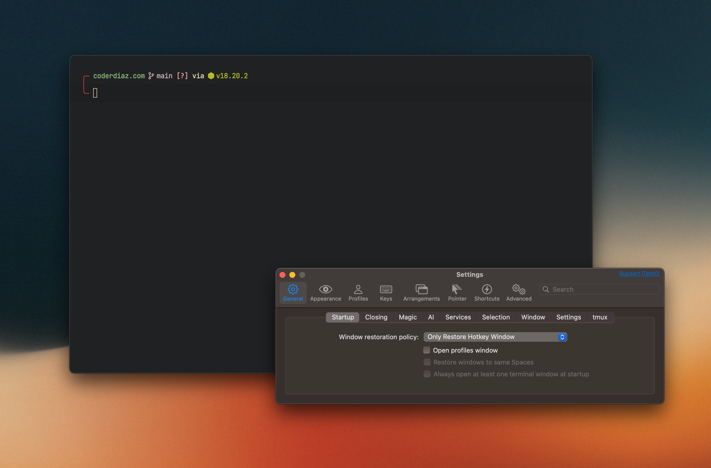
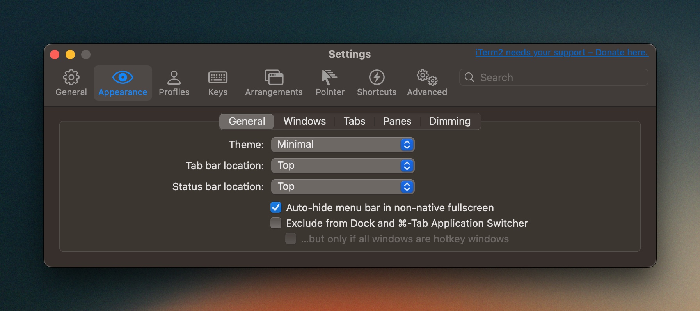
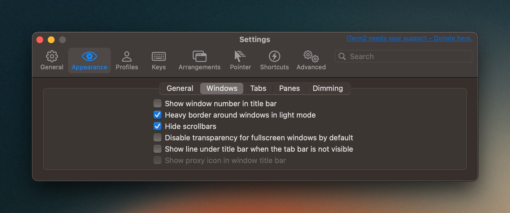
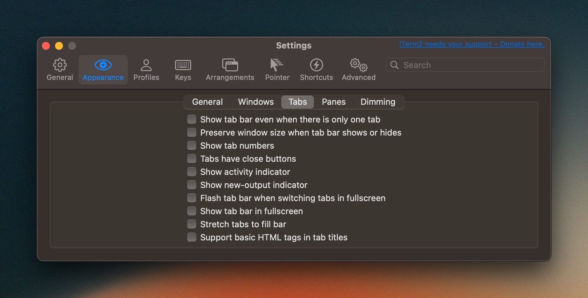
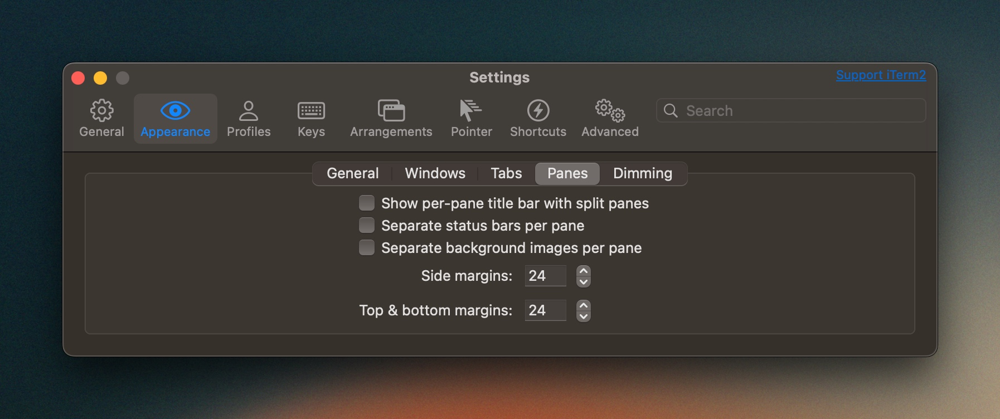
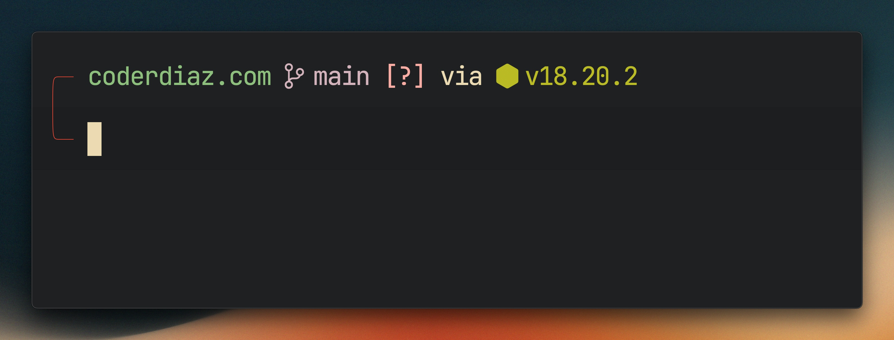
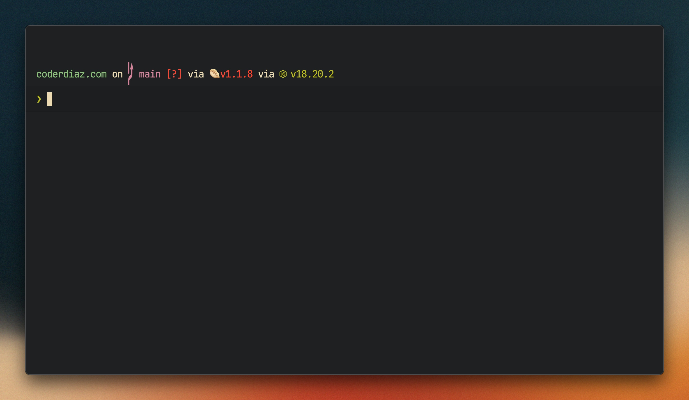

import Callout from '@/components/Callout.astro';
import Separator from '@/components/Separator.astro';

En muchas ocasiones, cuando estoy impartiendo clases o durante mis transmisiones en vivo por Twitch, me preguntan cómo he modificado mi terminal para que tenga un aspecto tan bonito. No me había dado a la tarea de escribir algo al respecto, así que aquí te cuento mis configuraciones y aplicaciones que utilizo.

<Callout>
  Nota: Este artículo está elaborado con configuraciones y aplicaciones que probablemente solo estén disponibles en MacOS.
</Callout>

## Lo primero, la terminal
Yo, personalmente, cuando estaba buscando con qué terminal trabajar, utilicé muchas de las que hay y que son muy famosas: Hyper, Alacritty, Warp, iTerm, entre muchas otras. La que más me ha gustado es `iTerm`, es una terminal muy sencilla de utilizar, minimalista y sin tantas complicaciones dentro de su configuración. Esto permite que puedas personalizarla a tu gusto y no tener que estar lidiando con tantas opciones que no vas a utilizar.

Recientemente, en la nueva versión de iTerm, incluyeron un plugin para utilizar OpenAI en la terminal, para que puedas potenciarla con IA y hacer cosas interesantes con ella, como el autocompletado inteligente. Aunque no lo he utilizado, es una opción que tienes disponible.

<figure class="flex flex-col gap-4 not-prose md:-mx-10 my-6 md:my-12">
  <div class="relative">
    
  </div>
  <figcaption class="block font-medim text-sm text-tones-500 text-center w-full">
    Fig 1. Mi terminal iTerm en acción
  </figcaption>
</figure>

### Mi configuración inicial
Lo primero que hago es colocarle un diseño minimalista, ya que por defecto trae la barra de título y la barra de pestañas, que son dos funcionalidades que, de forma personal, no utilizo, ya que trabajo siempre por divisiones en la ventana y con un solo panel de terminal, el cual puedo abrir en cualquier escritorio sin tener que mover la ventana.

<figure class="flex flex-col gap-4 not-prose md:-mx-10 my-6 md:my-12">
  <div class="relative">
    
  </div>
  <figcaption class="block font-medim text-sm text-tones-500 text-center w-full">
    Fig 2. Configuración de la apariencia general de iTerm
  </figcaption>
</figure>

Además, también cambié el comportamiento de las ventanas y las pestañas para tenerlo lo más limpio posible y sin tantas cosas que puedan distraerme.

<figure class="flex flex-col gap-4 not-prose md:-mx-10 my-6 md:my-12">
  <div class="relative">
    
  </div>
  <figcaption class="block font-medim text-sm text-tones-500 text-center w-full">
    Fig 3. Configuración de la apariencia de las ventanas
  </figcaption>
</figure>

<figure class="flex flex-col gap-4 not-prose md:-mx-10 my-6 md:my-12">
  <div class="relative">
    
  </div>
  <figcaption class="block font-medim text-sm text-tones-500 text-center w-full">
    Fig 4. Configuración de las pestañas en la ventana
  </figcaption>
</figure>

Ahora, una vez que hayas realizado estos cambios, tendrás que reiniciar tu terminal para ver reflejados los cambios y podrás ver que la terminal se ve mucho más limpia y minimalista. Ahora, esto es por gusto personal, pero a mí me gusta agregarle unos espaciados en los bordes laterales para que se sienta mejor.

<figure class="flex flex-col gap-4 not-prose md:-mx-10 my-6 md:my-12">
  <div class="relative">
    
  </div>
  <figcaption class="block font-medim text-sm text-tones-500 text-center w-full">
    Fig 5. Configuración de los paneles
  </figcaption>
</figure>

## El tema
Yo estoy utilizando `Gruvbox`, me gustan mucho los colores y es uno de los temas que más me gustaron. Está personalizado con algunos cambios en los contrastes de colores. De igual forma, no he encontrado el original, pero te dejo el enlace para que puedas descargarlo sin problema por si quieres aplicarlo.

También puedes optar por buscar el que mejor te agrade; hay muchos en internet para iTerm para todos los gustos.
<br />

<a href="https://coderdiaz.com/Gruvbox.itermcolors" rel="noreferrer" class="my-4 w-full md:w-max px-6 py-3 text-center rounded-full bg-accent-400 text-accent-1000 font-semibold transition hover:bg-accent-400/75 no-underline">Descargar tema Gruvbox</a>
<br />
<br />
<br />

<Separator />

## Y ahora, el prompt

Aunque puedes hacerlo completamente utilizando Bash, si no tienes el conocimiento de cómo modificar el prompt, puede ser todo un lío. Sin embargo, si lo quieres intentar o ya sabes cómo hacerlo, esta referencia de implementación te puede ayudar.

<figure class="flex flex-col gap-4 not-prose md:-mx-10 my-6 md:my-12">
  <div class="relative">
    
  </div>
  <figcaption class="block font-medim text-sm text-tones-500 text-center w-full">
    Fig 6. Mi prompt personalizado con Starship
  </figcaption>
</figure>

Para lograr este resultado, yo utilizo `Starship`, un prompt basado en Rust que es muy fácil de configurar y personalizar. Incluye diferentes elementos que puedes agregar a tu terminal para añadirle potencial, como por ejemplo, mostrar la rama en la que estás actualmente en Git, la versión de Node, Ruby, Python, Go, entre otros, y muchas cosas más.

Si estás en macOS, tienes muchas formas de instalarlo; generalmente, la más fácil es a través de Brew, pero si no lo tienes instalado, puedes hacerlo manualmente descargando el binario desde la página oficial de Starship.

```bash
# homebrew
brew install starship

# curl
curl -sS https://starship.rs/install.sh | sh
```

Una vez que hayas hecho la instalación, este te indicará cómo activarlo en tu terminal que tengas instalada y de esa forma cargue el nuevo prompt. En mi caso, estoy utilizando `Oh My Zsh`, por lo que la configuración es la siguiente en el archivo `~/.zshrc`:

```sh
eval "$(starship init zsh)"
```

<figure class="flex flex-col gap-4 not-prose md:-mx-10 my-6 md:my-12">
  <div class="relative">
    
  </div>
  <figcaption class="block font-medim text-sm text-tones-500 text-center w-full">
    Fig 7. Prompt con valores por defecto con Starship
  </figcaption>
</figure>

Con esto podrás ver que la terminal ha cambiado la forma en la que se presenta. Ahora es momento de activar cada una de las cosas. Para no hacer muy largo el artículo, aquí te comparto mi archivo de configuración `~/.config/starship.toml` con los elementos que tengo activados:

```toml
add_newline = false
command_timeout=4000

[cmd_duration]
format = "took [$duration]($style) "

[directory]
truncate_to_repo = true
style = "bold cyan"

[git_branch]
#symbol = " 
symbol = " "
style = "bold bright-purple"
format = "($style)[$symbol]($style)[$branch]($style) "

[git_status]
style = "bright-red"

[git_metrics]
disabled = false
added_style = "green"
deleted_style = "red"
format = "(\\[([+$added]($added_style))([-$deleted]($deleted_style))\\])"

[nodejs]
disabled = false
style = "green"
symbol = " "

[package]
disabled = false
display_private = true
symbol = " "
style = "bold green"

[time]
disabled = false
style = "bold yellow"

[username]
disabled = false
show_always = true
format="[ $user]($style)"

[aws]
symbol = " "

[docker_context]
symbol = " "

[memory_usage]
symbol = " "

[python]
symbol = " "
detect_files=[".python-version", "Pipfile", "__init__.py", 
"pyproject.toml", "requirements.txt", "setup.py", "app.py"]

[rust]
symbol = " "
```

Podrás ver que los símbolos no se visualizan de forma correcta; esto es porque para ello necesitarás tener cargada la fuente `Nerd Fonts` en tu terminal. Si no la tienes, puedes descargarla desde la página oficial de Nerd Fonts y seguir las instrucciones de instalación.

### El estilo del prompt

Para lograr el resultado de mi `prompt`, tendremos que modificar su formato. Para ello, necesitarás modificar el archivo `~/.config/starship.toml` y agregar el siguiente formato:

```toml
format = """
[╭─](red) $directory$git_branch$git_metrics$git_status$package$nodejs
[╰─](red) """
```

De esta manera, podrás tener este aspecto tan hermoso que sinceramente se siente muy bien.

## Conclusión
Ahora es tu turno de personalizar la terminal a tu gusto. Recuerda que la terminal es una herramienta de trabajo y, entre más cómoda te sientas con ella, más productivo puedes llegar a ser. Si tienes alguna duda o pregunta, no dudes en escribirme en mis redes sociales.

De igual forma, compárteme tu terminal a través de X para saber el resultado que has logrado con estas configuraciones. 

Nos vemos pronto.