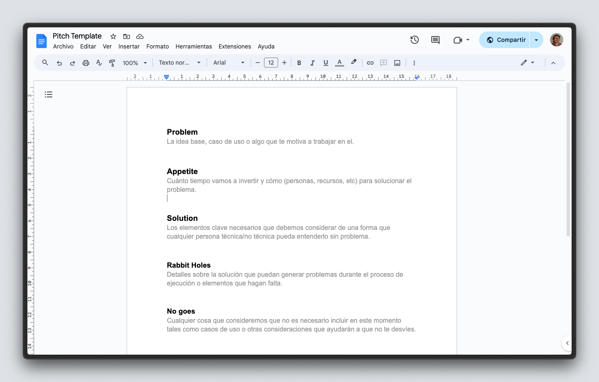

import Callout from '@/components/Callout.astro';

Ocasionalmente, nos encontramos trabajando en algún proyecto y nos encontramos con deuda técnica que sigue sin atenderse y creciendo constantemente, provocando que el código comience a complejizarse cada vez más.

En este artículo, te compartiré mi experiencia lídiando con este problema y algunas técnicas que me ayudaron a salir de este bucle.

## El cíclo de la refactorización infinita

Antes de partir, es importante dar en contexto sobre lo que implica una refactorización:

<Callout class="bg-blue-50 text-ble-800 border-blue-300 leading-normal">
  La **refactorización** es un proceso en el cual se busca mejorar una parte en el código con el objetivo de implementar mejores prácticas que permitan su mantenimiento y legibilidad, permitiendo así poder escalarlo.
</Callout>

En general, cada que tocamos un proyecto o empezamos uno nuevo, habrá momentos en los cuales los tiempos y las premuras de las cosas se postran frente a nosotros y tenemos que implementar soluciones que podemos posteriomente mejorar. Sin embargo, aquí es donde comienza el problema.

Aunque nosotros pretendamos agregar un bonito `TODO` en nuestro código para volver allí y mejorarlo, al final terminamos por no hacerlo debido a muchas circunstancias que se presentan durante el proceso de desarrollar un producto.

Esto frecuentemente sucede ya que el negocio tiene otras prioridades o nuevas cosas que busca implementar y debes enfocarte en seguir produciendo nuevos features, por lo cual, se comienza a generar deuda técnica al no poder realizar estas mejoras.

¿Pero cómo podemos lidiar con esto? Bueno, la realidad es que hay muchas maneras de hacerlo y aquí te compartiré algunas que me han ayudado al proponerlas con los equipos en los que he trabajado.

## Cómo lidiar con la refactorización

### Establecer un alcance específico
Al determinar un objetivo claro de lo que vas a trabajar, te permitirá mantenerte enfocado en lo que debes hacer y no caer en el error de querer refactorizar todo el código. Una forma que me ha ayudado a establecerlo es a tráves de una técnica propuesta por la metodología Shape Up, llamado "Pitch", el cuál constituye crear un documento donde se describe el problema y la solución que se busca implementar junto con los problemas que se pueden anticipar.

<figure class="flex flex-col gap-4 not-prose md:-mx-10 my-6 md:mt-12">
  

    
  

  <figcaption class="block font-medim text-sm text-tones-500 text-center w-full">
    Template de Pitch con Shape Up
  </figcaption>
</figure>
También, hay otros tipos de documentos que pueden ayudarte a establecer un alcance específico, como los "RFC" (Request for Comments) que son muy utilizados en empresas de tecnología para proponer cambios en el código, o un Design Document que te permitirá establecer un alcance más técnico.

### 1. Aplica un tiempo de implementación
Sé que esto no va a ser nada fácil porque siempre las prioridades del negocio son más importantes, pero también es parte de tu experiencia como desarrollador el plantear la problemática de tener código que no se puede mantener y que a la larga puede ser un problema para el negocio. Por lo tanto, debe ir muy de la mano con la primera para que tengas evidencias de cuál es el problema, cuánto tiempo te llevará y cuál es el beneficio que se obtendrá.

### 2. Sé crítico con el code review
Aunque este podría considerarse como prevención, es muy importante mencionarlo, ya que muchas veces podemos prevenir código inestable si somos críticos con lo que estamos revisando. Siempre es importante preguntarse si lo que hace ese bloque está bien, y si no es así, adaptarlo para que sea fácil de mover cuando sea necesario y no haya la necesidad de cambiarlo en su totalidad.

De esta forma, también podemos aprender de las experiencias de nuestros colegas desarrolladores y mejorar nuestro código de manera constante para que ocurra con menos frecuencia.

### 3. Define pruebas en tu código
Las pruebas son una parte fundamental en el desarrollo de software, ya que nos permiten asegurarnos de que el código que estamos escribiendo funciona correctamente. Por lo tanto, si definimos pruebas para nuestro código, podremos refactorizarlo con mayor seguridad y confianza.

## La evolución
Sin duda, siempre habrá que refactorizar algo en nuestro código, es algo casi inevitable ya que los negocios cambian y las necesidades de los usuarios también, pero siempre es importante reducirlo a lo necesario y fundamental para que no caigamos en un ciclo infinito de refactorizaciones que no nos permitan avanzar.

No esperes a que el código se convierta en algo inmantenible y siente la confianza de platicarlo con el equipo y comparte con ellos tu preocupación para que juntos puedan encontrar una solución.

Recuerda que el código es un reflejo de cómo trabajamos y si no lo cuidamos, puede ser un problema a futuro.

Espero que este artículo te haya ayudado, y nos vemos pronto en el siguiente.

¡Muchas gracias por leer!