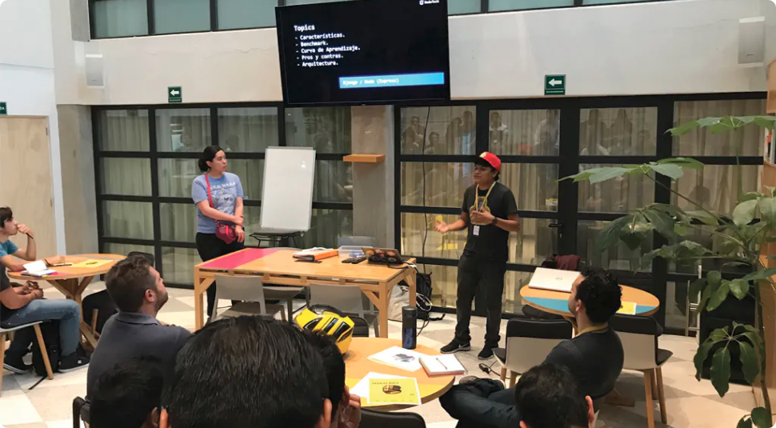

Me llamo Javier Diaz, y actualmente trabajo como ingeniero de producto senior en Lottus Education. También, escribo sobre mi experiencia en el mundo del desarrollo de software y ocasionalmente, también imparto clases.

  Experiencia profesional
  

    

      
Senior Product Engineer en Lottus Education

      2024 - Actualmente
    

    

      
Senior Product Engineer en Reboot Studio

      2022
    

    

      
Engineering Manager en BEDU

      2021 - 2022
    

    

      
Lead Software Engineer en BEDU

      2019 - 2021
    

    

      
Senior Frontend Engineer en Cultura Colectiva

      2017 - 2019
    

    

      
Fullstack Developer en Pulpomatic

      2017
    

    

      
Web Developer en Administración Portuaria Integral

      2015 - 2017
    

  

  ### Mi filosofía

  Suelo decir que desarrollar software debería ser una experiencia agradable, y que la calidad del código es un reflejo de la calidad de vida de los desarrolladores. Es por eso, que busco proveer de software que se puedan mantener de forma simple. 

  Hace algunos años, me di cuenta que la mejor forma de seguir creciendo como ingeniero de software es pensar en las personas que utilizan los productos y no solo en las tecnologías. Por ello, dedique los últimos años en especializarme como Ingeniero de Producto.

  Decidí fusionar mis habilidades en ingeniería de software con el diseño de producto, y desde entonces, he trabajado y diseñado productos que han sido utilizados por miles de personas.

  ### Enseñanza

  - En 2020, decidí comenzar a crear contenido sobre tecnologías web tales como React.js, Strapi, bases de datos, y algunos más.
  - Desde 2017, brindo clases, talleres y capacitaciones sobre desarrollo web y diseño de producto. He colaborado con academias tales como BEDU, Platzi y Códigofacilito. También, he tenido la oportunidad de brindar capacitaciones técnicas a empresas como Arcelor Mittal México.

  ### Charlas y talleres

  Siempre me ha gustado compartir mi aprendizaje y experiencia sobre desarrollo de software, ya sea en universidades o eventos de la comunidad. Si quieres que participe en en algún evento, [escríbeme](mailto:hey@coderdiaz.com).

  <figure class="flex flex-col gap-4 not-prose md:-mx-10 my-6 md:mt-12">
    

      
    

    <figcaption class="block font-medim text-sm text-tones-500 text-center w-full">
      Fig 1. Divulgando sobre Node.js en un workshop en Ciudad de México.
    </figcaption>
  </figure>

    

      

        
Panel de frameworks Frontend: Vue, React, y Angular

        Códigofacilito - 2023
      

      

        
Emprende con Open Source

        CCOSS - 2021
      

      

        
10 pasos para ser un buen desarrollador

        TECNM Campus Lazaro Cardenas - 2019
      

      

        
Ionic Framework en el desarrollo móvil

        TECNM Campus Lazaro Cardenas - 2018
      

    

