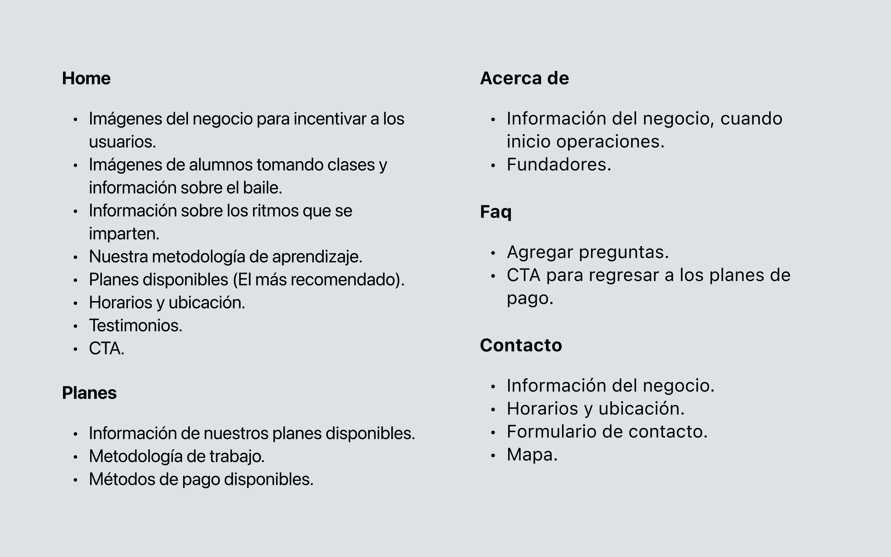
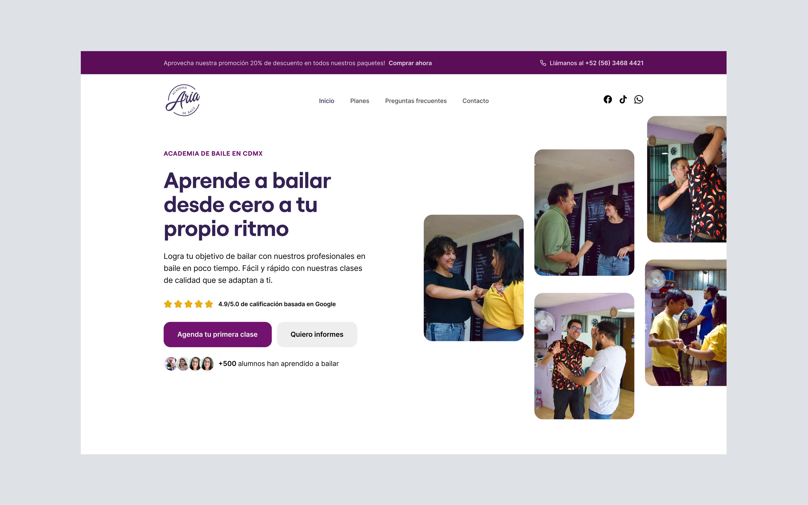
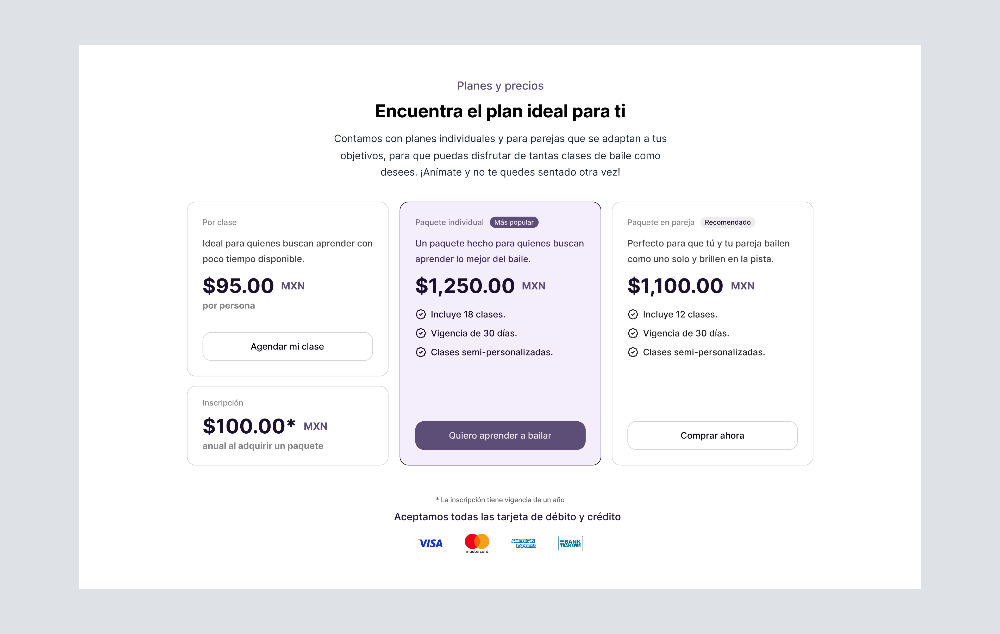
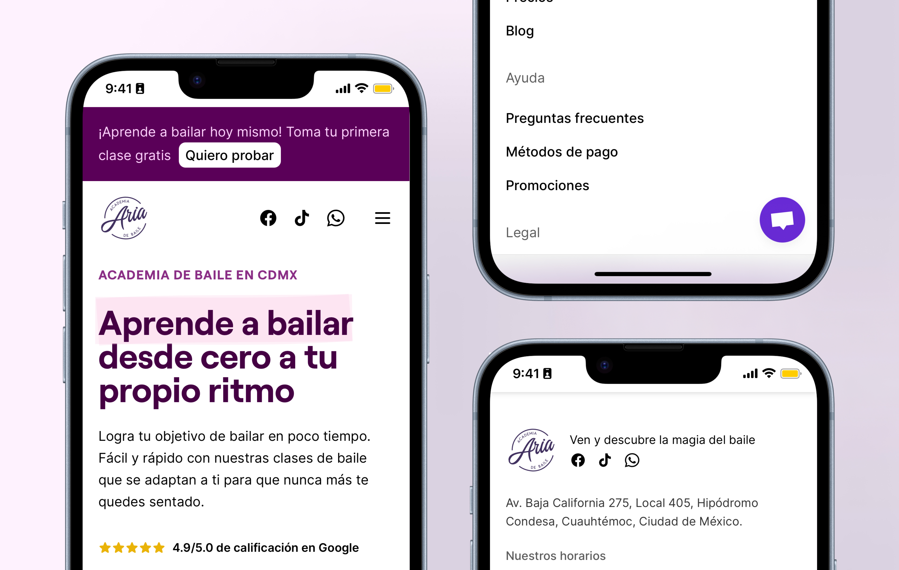

import Quote from '@/components/Quote.astro';
import Separator from '@/components/Separator.astro';
import BeckyAvatar from './becky.png';
import WebsiteVideo from './website.webm';

En solo algunos meses, se logro gracías al rediseño de la página web incrementar el tráfico un 75% y de esta manera el número de alumnos que se inscriben (conversión) en un 35%, un salto bastante notorio comparado con el año anterior, lo que indica que el rediseño de la página web ha sido un éxito.

<figure class="h-auto w-full">
  <video class="m-auto rounded-lg bg-background" loop controls autoplay src={WebsiteVideo} />
</figure>

Además, hemos logrado posicionarnos dentro de los primeros resultados de búsqueda en Google, lo que ha permitido atraer a más personas interesadas en aprender a bailar esto gracias a la estrategía que aplicamos en SEO.

## Nuevos objetivos, nuevos retos

El objetivo principal del sitio web de la academia, es fomentar en las personas la pasión por el baile. Para lograrlo, es necesario crear un diseño limpio y atractivo que refleje la esencia de la academia, y que el mismo usuario pueda encontrar la información que necesita de manera rápida y sencilla.

<Quote
  content="Buscamos acercar el baile a más personas, haciendo de este un estilo de vida."
  avatar={BeckyAvatar}
  avatarAlt="Avatar de Abigail Meza"
  author="Abigail Meza"
  jobTitle="Directora Academia de baile ARIA"
/>

Para esto, realizamos un análisis de la información que debería contener el sitio y cómo deberiamos presentarla. Uno de los retos más importantes fue el intentar atraer a un público más joven, por lo que se decidió utilizar colores más vivos y un diseño más moderno.

  

Por lo general, los usuarios que visitan nuestro sitio web rondan entre los 30 a 45 años de edad, por lo que decidimos utilizar un diseño fresco pero no tan arriesgado para no alejarnos de nuestro público objetivo.

## Diseño basado en bloques

Con el objetivo de brindar una mejor experiencia en el desarrollo, administración y mantenimiento del sitio, decidimos utilizar el enfoque basado en bloques. Esto nos permité crear un diseño modular y flexible, que se adapta a las necesidades de la academia.

Además, hemos interactuado con el equipo de la academia para obtener feedback sobre el diseño y la información que se presente en la página.

  

    
  

  

    
  

<Separator />

## Operacional

Crear un sitio web más allá de solo crear un diseño atractivo para los usuarios y ofrecer una increíble experiencia. Generalmente, muchas tiendas en línea dedican demasiado tiempo a tareas manuales y repetitivas.

Para evitar esto, hemos implementado un sistema de administración de contenido (CMS) que permite a los administradores de la academia actualizar la información del sitio de manera rápida y sencilla.

Aprovechando el potencial del enfoque basado en bloques, de esta manera, permitimos que los administradores puedan gestionar el sitio de forma independiente, sin necesidad de conocimientos técnicos.

Esto nos ayudó a:

- Ofrecer una edición del contenido de forma rápida.
- Permitir modificar los bloques disponibles en cada página.
- Crear nuevas páginas de forma sencilla.

<Separator />

## Aplicación Móvil

Para ofrecer la misma experiencia que en escritorio, hemos diseñado el sitio pensando 100% en la experiencia móvil, por lo que hemos creado un diseño responsivo que se adapta a cualquier dispositivo.

Actualmente, el 85% de las visitas en el sitio web se llevan a cabo desde dispositivos móviles, por lo que es importante ofrecer una experiencia de usuario óptima en estos dispositivos.

De igual manera, hemos optimizado el rendimiento del sitio para que cargue de forma rápida y evitemos que los usuarios abandonen el sitio por tiempos de carga largos.

  

