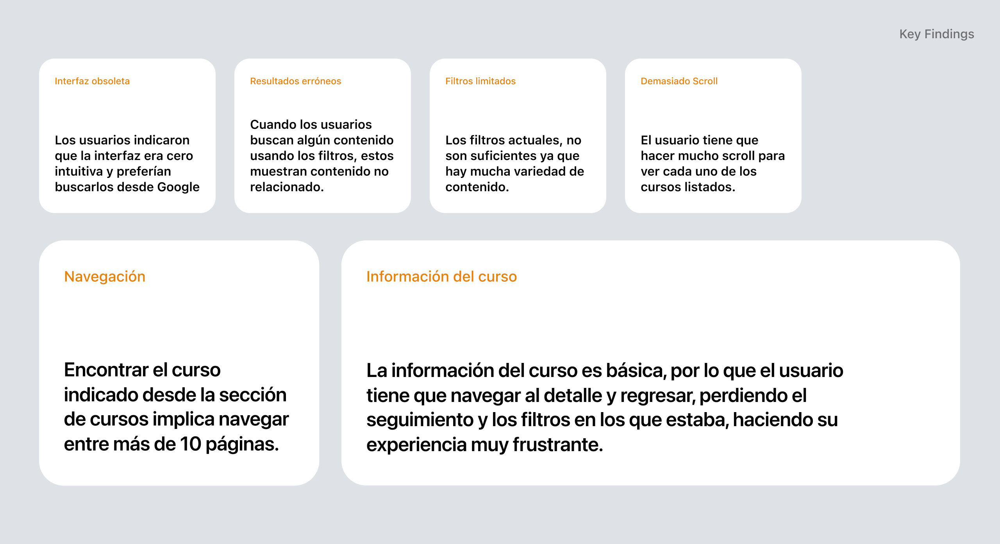
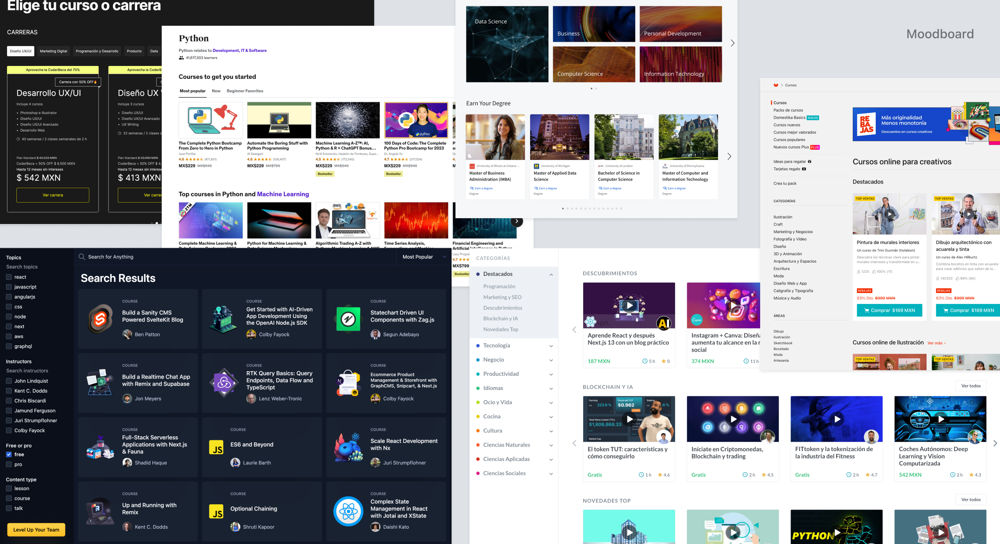
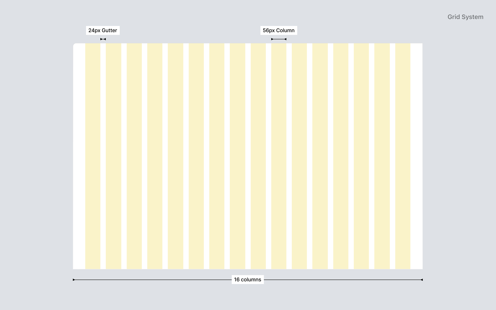
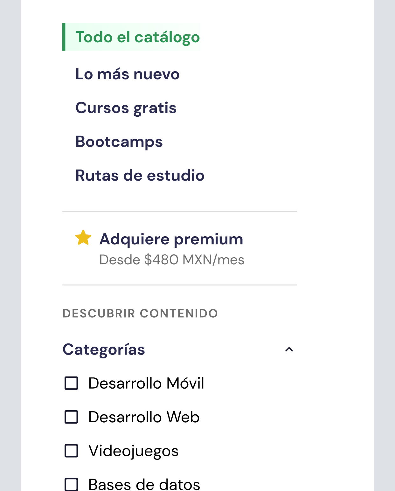
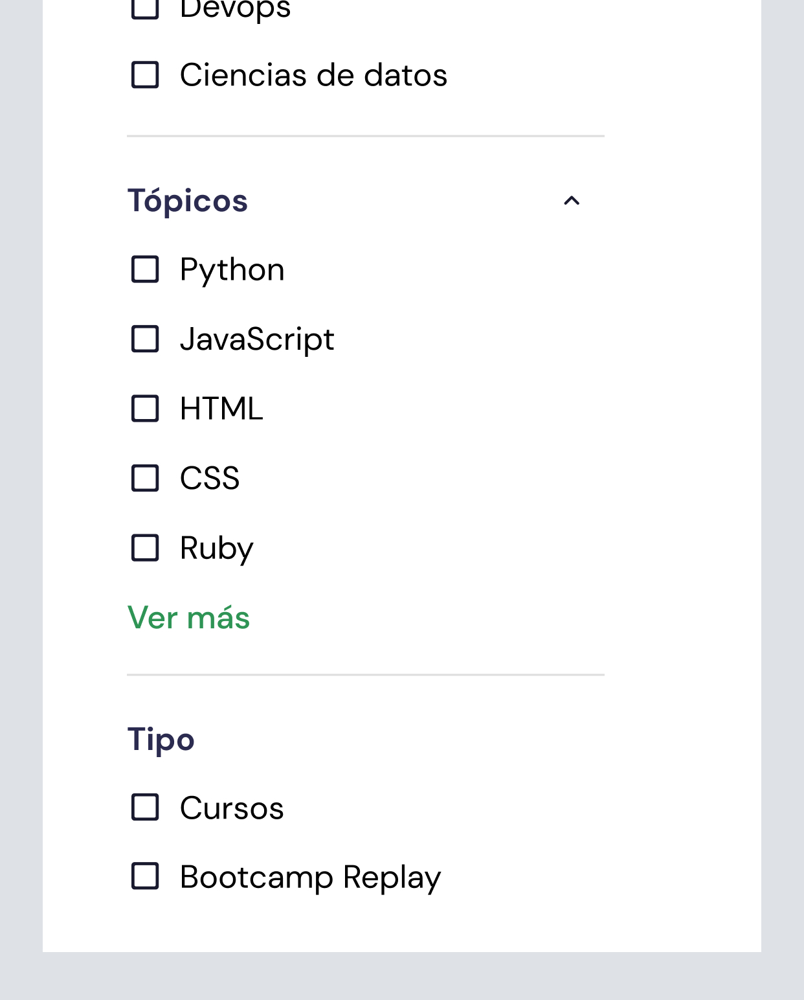
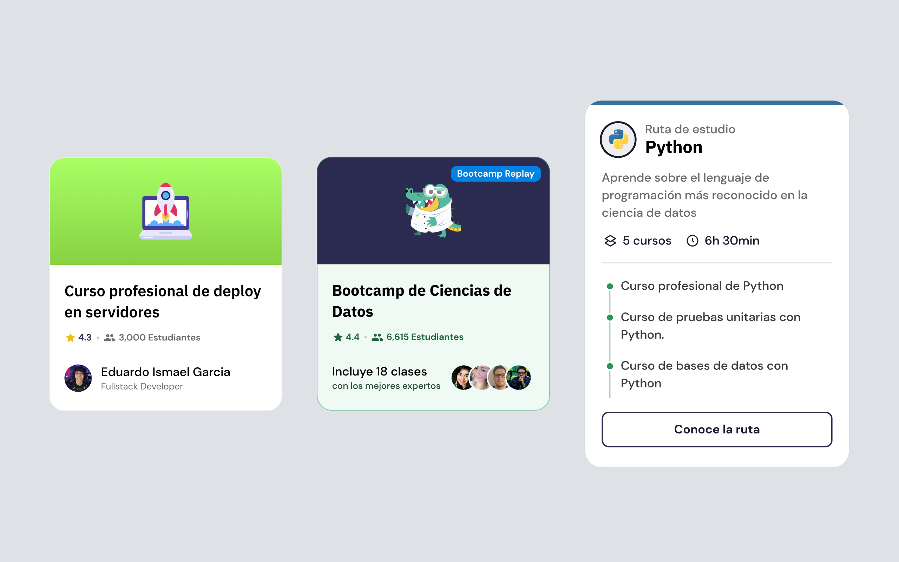
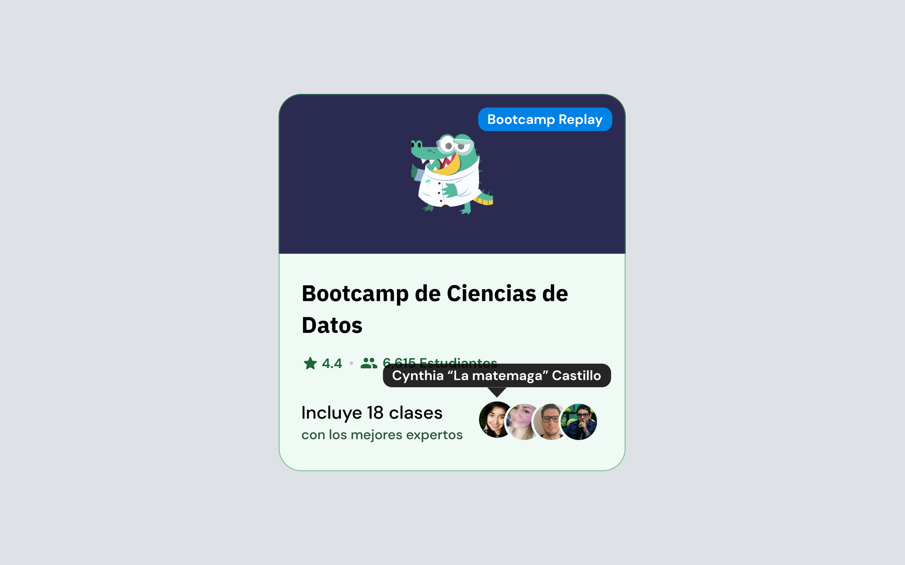
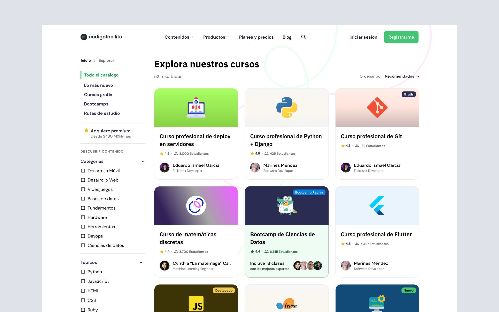
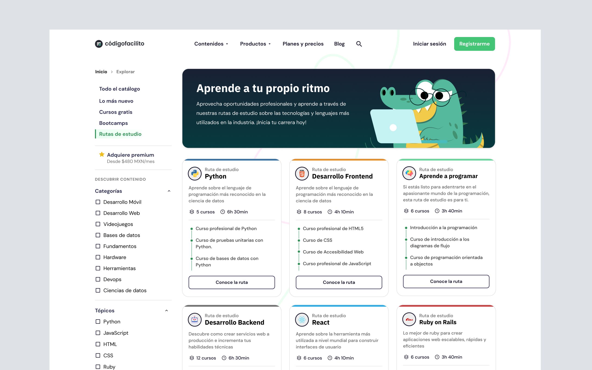

Códigofacilito es una plataforma de educación en línea que ofrece cursos, bootcamps y rutas de estudio para aprender programación, diseño y marketing digital. La plataforma cuenta con una amplia variedad de cursos y bootcamps para que los usuarios puedan aprender de forma autodidacta y mejorar sus habilidades.

## Auditoria UX y hallazgos

Ánalizamos el comportamiento y uso de la plataforma para identificar los principales problemas y oportunidades de mejora. Estos fueron los hallazgos:

  <iframe class="w-full h-full aspect-video" loading="lazy" src="https://docs.google.com/presentation/d/e/2PACX-1vSDqxv4xSFSnOkQbOYCKhLIE2rUecQoiYPpWiRgvsajPJrlL5qNZ36bUvlaRmBBOEy0DivYNZmRROxV/embed?start=false&loop=false&delayms=3000" frameborder="0" width="1280" height="720" allowfullscreen="true" mozallowfullscreen="true" webkitallowfullscreen="true" />

Además, realizamos una entrevista con usuarios para conocer sus necesidades y expectativas al buscar cursos y bootcamps en línea, tomando en cuenta usuarios de pago y gratuitos.

### Estos son algunos de los puntos identificados

Seleccionamos los puntos mas relevantes que nos proporcionaron los usuarios y la investigación previa realizada. Esto nos ayudó a crear una estrategía sobre la cuál trabajar para mejorar la experiencia de esta página.

  

    
  

## Dirección visual

Para poder realizar el rediseño, realizamos una investigación de los competidores actuales y las tendencias de diseño actuales. De esta forma, pudimos determinar que elementos visuales utilizar, como estructurar la página y definir mejoras en la experiencia de navegación. 

Este proceso nos ayudó a definir a detalle la dirección visual que tomaríamos.

  

    
  

  

    
  

## Encuentra lo que buscas

Lo principal aquí, es brindarle al usuario una experiencia de búsqueda y navegación intuitiva. Por lo que definimos un sistema de filtros y categorías para que puedas encontrar todo lo que buscas en un solo lugar sin tener que moverte por todos lados.

  

    

      
    

    

      
    

  

Con esto podemos navegar e incluir secciones que permitan a los usuarios encontrar contenidos segmentados y filtrados globalmente, es decir, que pueda ver los cursos que son gratis y filtrarlos por categoría o tema de interés. Haciendo que de esta manera, el usuario pueda filtrar y encontrar el contenido que estaba buscando.

## Descubre lo que te interesa

Para ayudar a los estudiantes a conocer más sobre los cursos y bootcamps, hemos creado diferentes tarjetas que ayudarán a tener mayor entendimiento de los detalles del curso. Además, también se mantienen valoraciones e información sobre el instructor, ya que es un punto importante para los usuarios.

  

    
  

Cada una de ellas, ofrece la información primordial de acuerdo a su tipo, por ejemplo, la de ruta de estudio se han añadido los iniciales que la componen y la duración total de la misma para que el estudiante pueda tener una idea de lo que va a aprender.

También, en la tarjeta de bootcamps generalmente participan múltiples instructores, por lo que se ha añadido una interacción para poder saber quién es quién.

  

    
  

## Resultado

Con estas mejoras, los usuarios podrán disfrutar de una mejor experiencia buscando el contenido que quieren aprender y encontrarlo de forma más rápida y sencilla. Además, podrán conocer más sobre los cursos y bootcamps antes de inscribirse, lo que les permitirá tomar una mejor decisión.

  

    
  

  

    
  

