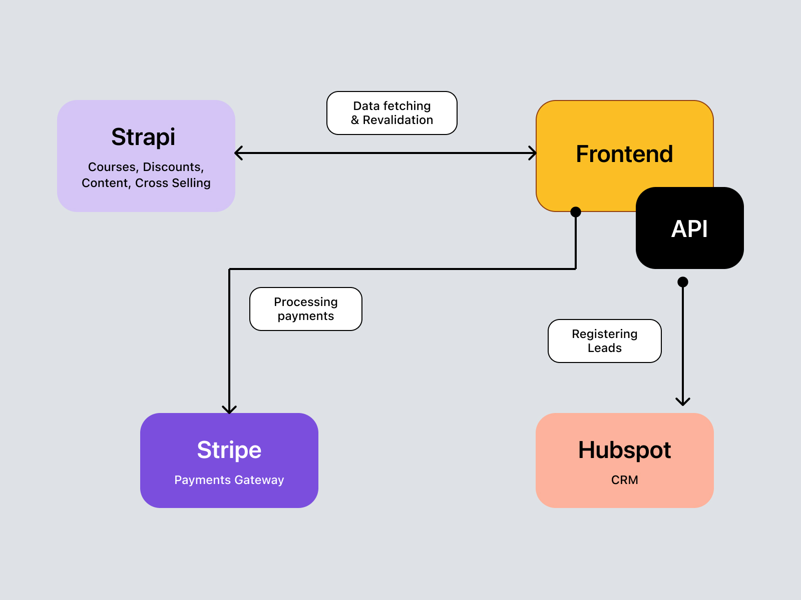
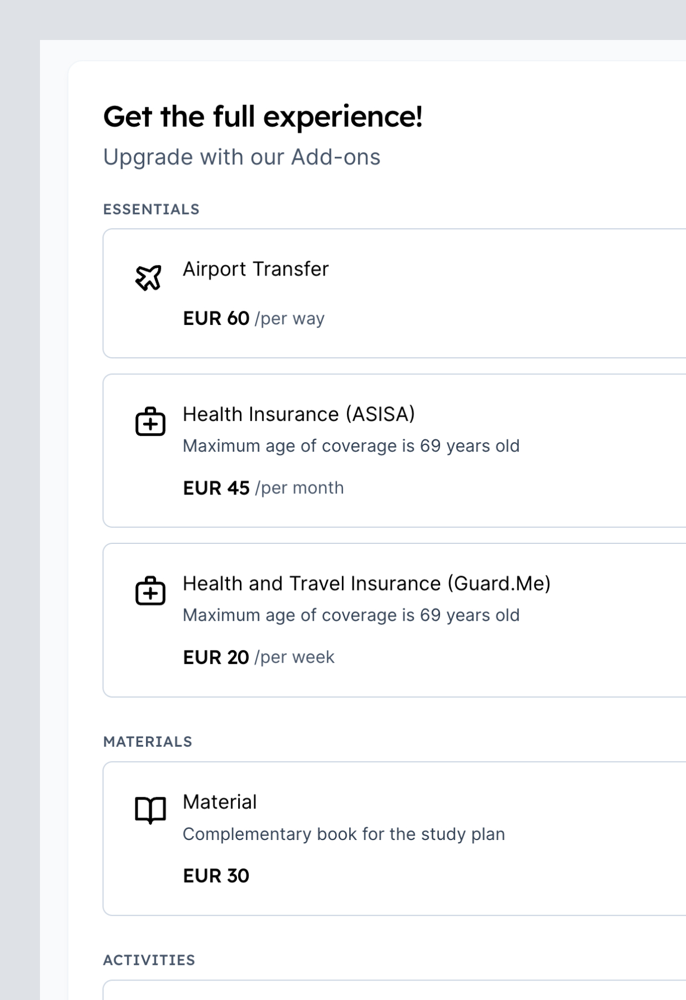

import Quote from '@/components/Quote.astro';
import OptionsVideo from './options-component.webm';
import Agustin from './agustin.avif';

Durante varios años Expanish ha sido una de las academias del idioma Español más reconocidas en Argentina y España, debido a este crecimiento, Expanish vio la necesidad de mejorar su proceso de compra en línea para que los usuarios pudieran tener una experiencia de compra más amigable y satisfactoria.

Actualmente, era un proceso muy tedioso y complicado para quienes lo administraban ya que todo se hacía de forma manual y no había un sistema que permitiera automatizar el proceso de carga de precios y actualización de la información.

Por lo que decidimos trabajar en el rediseño y mejorar el proceso en conjunto con todo el equipo de Expanish.

## Retos a resolver

La administración del contenido, la actualización de precios y la disponibilidad de los cursos era un proceso que se hacía de forma manual, lo que provocaba que la información no estuviera actualizada y que los usuarios tuvieran que interactuar en todo momento con el equipo de ventas provocando cuellos de botella en proceso.

Por lo que optamos en crear un servicio en el que se pudiera administrar toda la información de los cursos, precios, disponibilidad y que se pudiera integrar con el sistema de pagos de Expanish.

### Tecnologías utilizadas y arquitectura
Con la finalidad de brindar una experiencia para los administradores del sistema, optamos por utilizar Strapi.js como CMS para administrar el contenido y backend, y Next.js para el frontend de la aplicación.

  

De esta forma, usuarios que no tienen conocimientos técnicos pueden administrar la información de los cursos, precios y disponibilidad sin fricción.

## Diseño y experiencia

Para el diseño y experiencia de usuario, nos enfocamos en crear un proceso de compra muy sencillo y rápido, donde el usuario pudiera ver toda la información de los cursos, precios y disponibilidad de forma clara y concisa. Sin embargo, durante el proceso de compra, hay una variedad de cursos y precios disponibles para cada uno de ellos, por lo que era muy importante que el usuario pudiera ver toda la información de forma clara y concisa.

<Quote
  content="En Expanish, buscamos siempre brindar la mejor experiencia de compra para nuestros estudiantes, para que así, no haya dudas al momento de elegir un curso."
  avatar={Agustin}
  avatarAlt="Avatar de Agustin Vignale"
  author="Agustin Vignale"
  jobTitle="Co-fundador y Director comercial"
/>

Para solucionarlo, creamos este componente que permite visualizar la información concreta de cada opción y seleccionarla muy fácil.

<figure class="h-auto w-full">
  <video class="m-auto rounded-lg bg-background" loop controls autoplay src={OptionsVideo} />
</figure>

Cada componente puede ser personalizado y adaptado de acuerdo a las necesidades que se tengan en el futuro, por lo que lo hace muy flexible y escalable, brindando una mejor experiencia para los usuarios.

  

    

      
    

    

      
    

  

  

    
  

### Venta cruzada entre productos

Para realizar una venta cruzada entre productos, se añadieron opciones para que el usuario pudiera seleccionar los productos relacionados a cada uno a través del CMS de Strapi, de esta forma, el usuario puede ver toda la información de los productos relacionados y seleccionarlos.

  

    
  

## Conclusión
El diseño y el desarrollo del nuevo 
proceso de checkout, permitió a Expanish mejorar la experiencia de compra para sus usuarios, lo que se vio reflejado en un aumento de las conversiones y una disminución en el abandono del carrito. Además, el equipo de operaciones, se vio beneficiado al tener un proceso más eficiente al poder gestionar los cursos y promociones que se ofrecen en la escuela.

Constantemente, seguimos estamos haciendo iteraciones para seguir mejorando la experiencia de acuerdo a los datos que nos proporcionan nuestras herramientas de analítica y de usabilidad.