import Separator from '@/components/Separator.astro';

Expanish es una escuela de español con sede en Argentina y España, y se especializa en la enseñanza del idioma español a estudiantes internacionales. La escuela ofrece diferentes tipos de programas, tales como, cursos grupales, clases privadas, cursos de largo plazo, entre otros.

## Analicemos el reto

Uno de los principales objetivos de Expanish es brindar la mejor experiencia de navegación en dispositivos móviles, por lo que toda la implementación y especificaciones deben ser considerando mobile-first. Se busca mantener una estética limpia y moderna, que refleje la calidad de la educación que se imparte en la escuela.

También, se debe tomar en cuenta el rendimiento del sitio web, ya que su principal función es la de mantener la velocidad de carga en lo mínimo posible para que los usuarios puedan acceder a la información rápidamente.

Por lo que debemos mantener los Core Web Vital en un rango aceptable para que el sitio web sea considerado rápido y eficiente y amigable con SEO.

<figure class="flex flex-col gap-4 not-prose md:-mx-10 my-6 md:mt-12">
  

    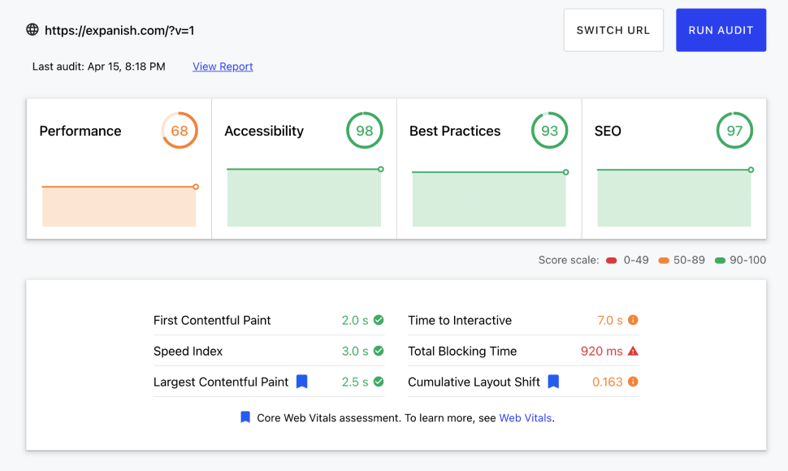
  

  <figcaption class="block font-medim text-sm text-tones-500 text-center w-full">
    Rendimiento antes de las mejoras y la nueva implementación
  </figcaption>
</figure>

### El principal objetivo

Se busca que el sitio web sea una herramienta de marketing y ventas para la escuela, por lo que se debe mantener una estructura clara y concisa para que los usuarios puedan encontrar e identificar los aspectos esenciales de la escuela.

Por ahora, el sitio web mantiene algunos elementos visuales que no son tan llamativos a los usuarios por lo que terminan abandonando el sitio.

  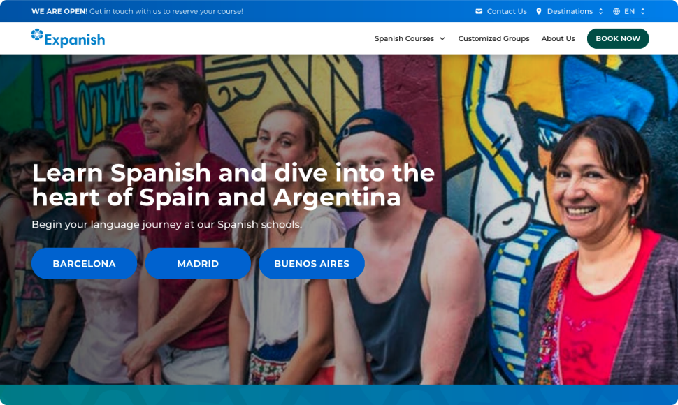

### Multi-idioma

Uno de los retos más complejos es la implementación de contenido en múltiples idiomas, ya que la escuela ofrece cursos en español, debe ser accesible para usuarios de diferentes países. Para este caso, se deben soportar **11 idiomas** diferentes.

### Tecnología y arquitectura

Para lograr que el sitio web pueda escalar sin complicaciones, hemos optado por trabajar en la generación del contenido utilizando el enfoque basado en bloques. De esta forma, el equipo de marketing puede crear y modificar las páginas fácilmente.

Para el CMS, optamos por utilizar **Strapi.js**, ya que es una de las herramientas que tiene mejor trabajado el soporte para multi-idioma de una forma simple y fácil de comprender por parte de usuarios no técnicos.

  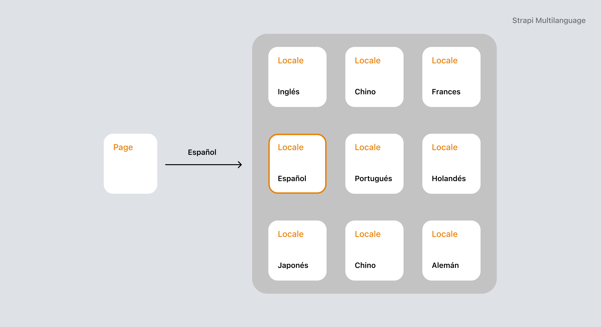

<Separator />

## La renovación ha llegado

Para lograr un diseño moderno y atractivo, hemos optado por utilizar una paleta de colores más vibrantes y llamativos, basandonos en el color actual de la marca. También, hemos optado por utilizar una tipografía más legible y moderna, que permita a los usuarios leer el contenido de una forma más fácil.

Con estas mejoras y cambios en la implementación del sitio web, logramos mejorar el rendimiento y la velocidad de carga del sitio web, manteniendo los Core Web Vitals en un rango aceptable.

<figure class="flex flex-col gap-4 not-prose md:-mx-10 my-6 md:mt-12">
  

    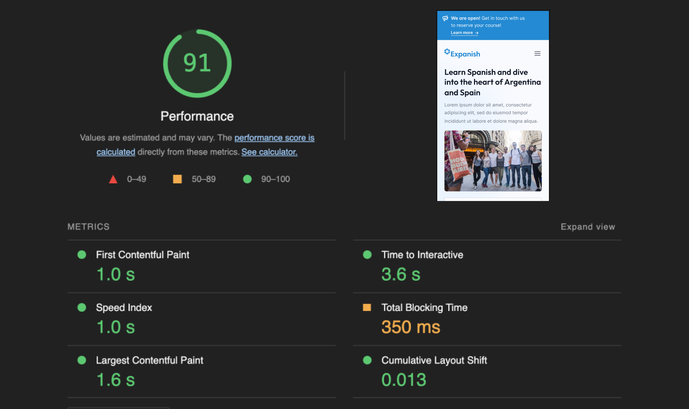
  

  <figcaption class="block font-medim text-sm text-tones-500 text-center w-full">
    Métricas después de las mejoras
  </figcaption>
</figure>

### Página principal

Para el negocio, lo más importante en este momento, es la adquisición de leads por medio de la página principal. Por lo que a esta primera pantalla, se ha agregado un widget donde el usuario puede interactuar con las cursos y destinos disponibles de acuerdo a sus necesidades.

También, hemos agregado en la sección un bloque donde mostramos de manera clara los destinos.

  

    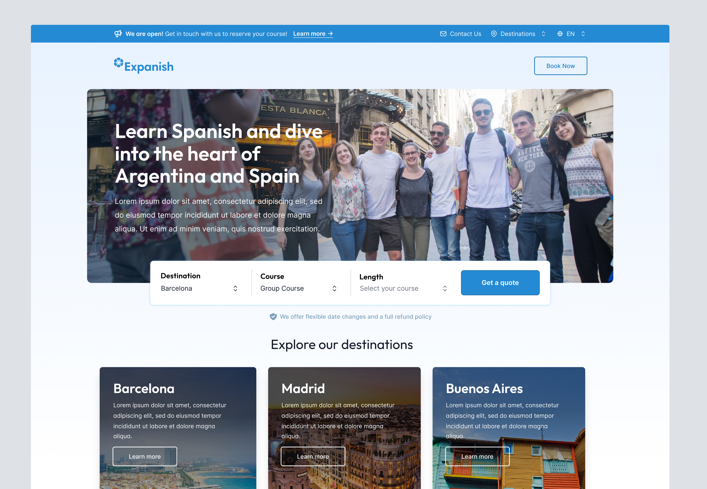
  

  

    

      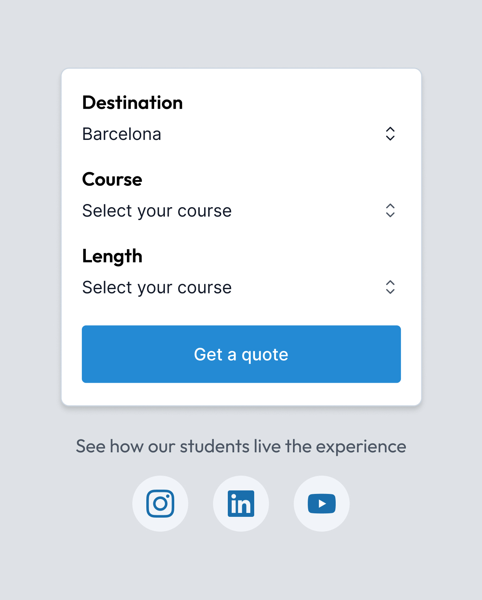
    

    

      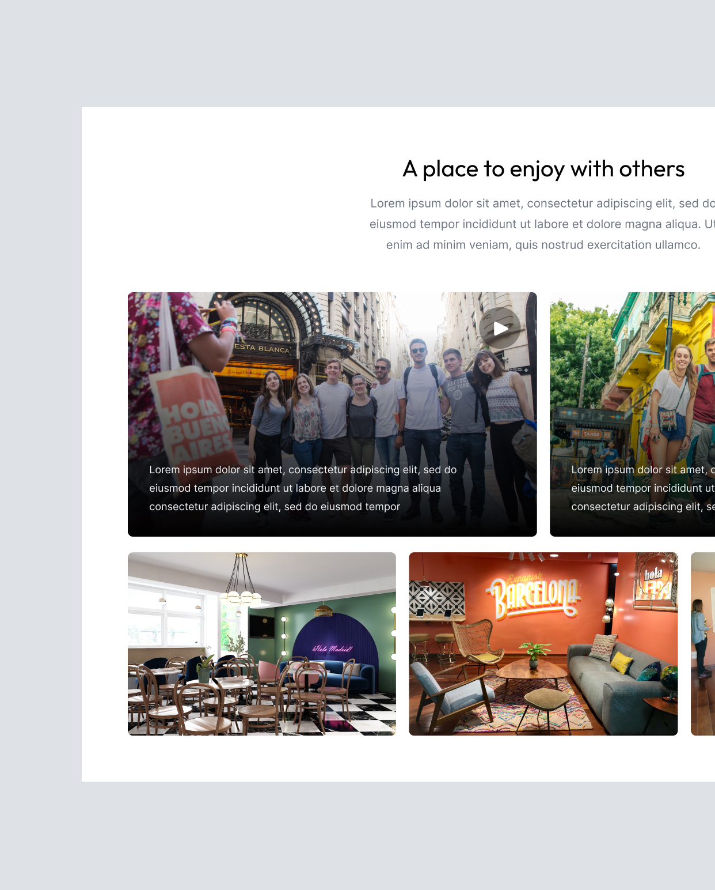
    

  

### Página de destino

Para las páginas de destino, se buscaba transmitir la sensación de gusto por el lugar donde puedes aprender, por lo que se ha optado por destacar imágenes y elementos visuales que permitan al usuario sentirse atraído por la escuela.

  

    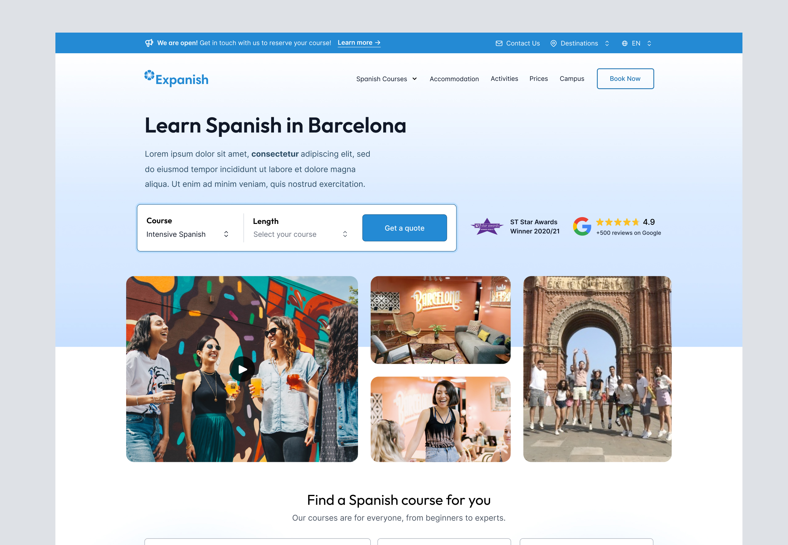
  

  

    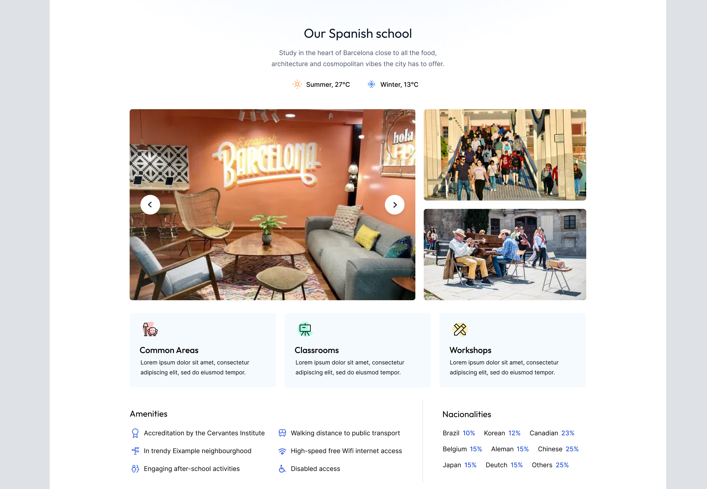
  

<Separator />

## Diseño optimizado para móviles

Cada uno de los bloques y secciones que hemos generado, fueron diseñadas para que se adapten fácilmente a dispositivos móviles. De esta forma, los usuarios pueden disfrutar de la misma experiencia en cualquier dispositivo.

  

    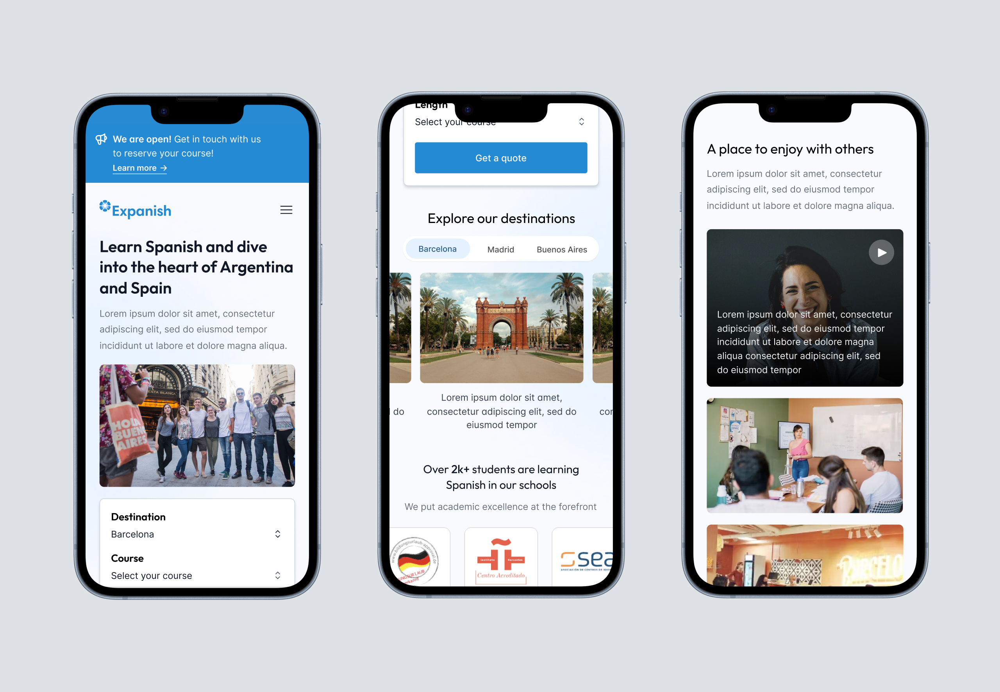
  

  

    

      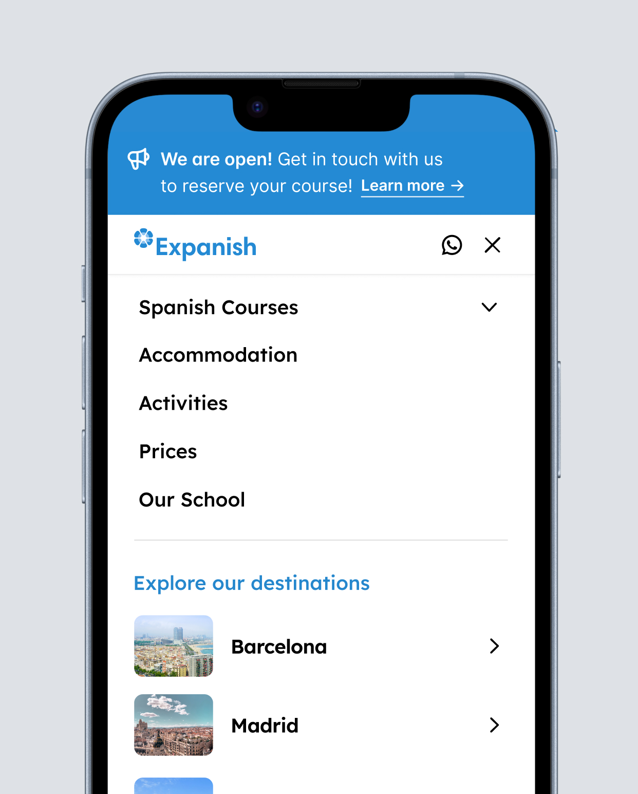
    

    

      
    

  

