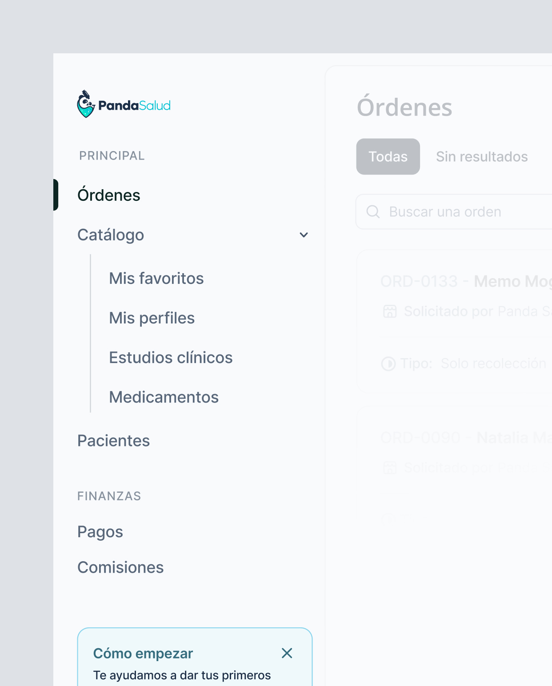

Panda Salud es una startup que permite a los médicos y pacientes acceder a estudios clínicos de forma simple y segura. La plataforma permite a los médicos buscar estudios clínicos para sus pacientes y obtener los resultados rápidamente.

## Mantener el orden y la claridad

Uno de las principales razones de rediseñar su plataforma, es que el proceso que se implemento inicialmente era muy complicado y tedioso para los médicos y pacientes, ya que no era intuitivo y generaba mucha confusión, lo que provoca que los médicos tuvieran dificultades para realizar la solicitud de estudios.

Tomando en cuenta esto, se realizaron las pruebas necesarias con usuarios y estos fueron los hallazgos:
- Generar una orden de estudios clínicos es difícil de procesar, debido a que el proceso no es intuitivo.
- Es difícil encontrar los estudios clínicos que se necesitan para los pacientes.
- No hay una forma de ver estado actual de los estudios clínicos para darle un seguimiento a lo solicitado.

## Único y fresco, que se adapta a las necesidades del usuario

Crear un experiencia visual y para el usuario es fundamental. Por lo que seleccionamos estructuras y colores que permitiera disfrutar de su estancia en la herramienta.

  

    
  

  

    
  

  

    
  

  

    

      
    

    

      
    

  

## Navega sin problemas por los módulos de la plataforma

Podrás explorar cada uno de los módulos disponibles fácilmente gracias nuestro menu amigable y mejor estructurado. Con categorizaciones que te permitirán encontrar lo que necesitas.

  

    

      
    

    

      
    

  

## Gestiona las solicitudes en un solo lugar

Da seguimiento oportuno a las solicitudes de estudios clínicos que se llevan acabo dentro de la clínica. Visualiza el estado actual de cada uno de los estudios y realiza las acciones necesarias.

  

    
  

  

    

      
    

    

      
    

  

  

    
  

## Crea ordenes de estudios clínicos de forma rápida

Sin complicaciones, crea tus ordenes de estudios a través del diseño intuitivo y amigable que hemos implementado en la plataforma, y selecciona los estudios a realizar.

  

    
  

  

    
  

## El resultado

Hemos creado una plataforma robusta, escalable y amigable con los usuarios, la cuál permitirá a los médicos solicitar estudios clínicos de una forma más rápida y amigable a través de esta nueva experiencia. Mi principal objetivo es siempre crear la mejor experiencia para el usuario, y en este proyecto lo hemos logrado, creando una plataforma que se adapta fácilmente a los usuarios y creando una relación más cercana con ellos.