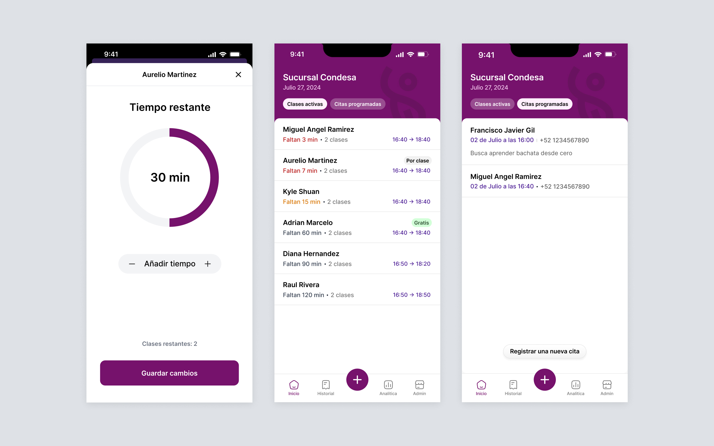
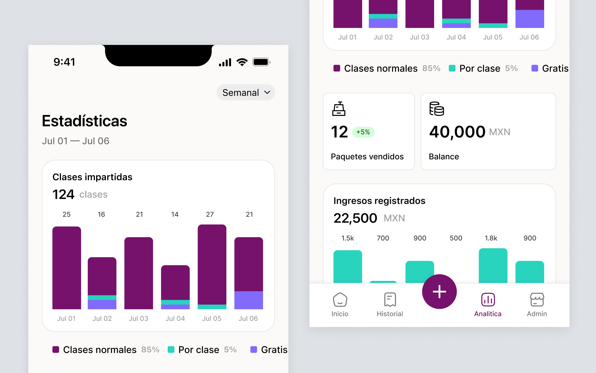
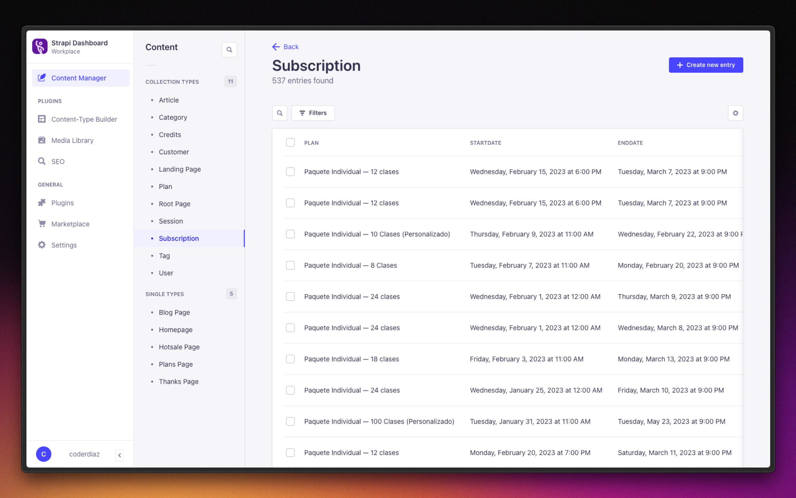

import { Image } from 'astro:assets';
import Shot2 from './shot_2.jpg';
import Shot3 from './shot_3.jpg';
import Shot4 from './shot_4.jpg';
import Shot5 from './shot_5.jpg';

Hace dos años junto a mi esposa, buscamos emprender un negocio enfocado en la enseñanza de ritmos latinos en la Ciudad de México, tales como Salsa, Cumbia y Bachata. 

Sin embargo, nos dimos cuenta que apesar de que hay software que puede cubrir parcialmente las necesidades para administrar una academia de baile, generalmente, el negocio se debe adaptar el software y no al revés, por lo que conforme iban cambiando las necesidades era más difícil adaptarlo.

### Primeras impresiones

Después de hacer el analisis correspondiente llegamos a la conclusión de que necesitabamos crear un software que se adaptará muy bien a nuestra necesidad puntual sin provocar demasiada fricción en el proceso y que el tiempo no fuera tan amplio para su implementación.

Hoy en día, los telefonos móviles se convirtieron en una herramienta promordial que portamos con nosotros a todos lados y que nos permite tener fácil acceso a la información de manera muy rápida y sencilla y desde cualquier lugar.

Por esta razón y después de mucha investigación, decidimos llevarla acabo como una aplicación móvil debido a su portabilidad.

## Clases de baile activas y citas programadas

Administra tus clases de baile sin complicaciones, crea tus clases, asigna tus alumnos y lleva un control de su tiempo de estancia, además de poder programar citas para dar seguimiento a nuevos prospectos.

  
  

    

      <Image src={Shot2} alt="Navegación mejorada" />
    

    

      <Image src={Shot3} alt="Una pantalla de bienvenida con lo fundamental a tu alcance" />
    

  

## Gestiona a tus alumnos y sus planes contratados
Podrás ver toda la información de tus alumnos, clases que han tomado, planes contratados y su vencimiento, todo en un solo lugar.

  

    <Image src={Shot4} alt="Encuentra al alumno para que inicie sus clases" />
  

  

    <Image src={Shot5} alt="Visualiza a detalle la información de tus clientes" />
  

## Conoce como va tu negocio y toma decisiones informadas

Podrás conocer el estado de tu negocio, saber cuántos planes se han contratado, cuanto se ha facturado y mucho más, para que puedas tomar decisiones.

  

## Más alla de lo ordinario

Con la finalidad de ofrecer la mejor calidad y experiencia en el entregable, buscamos utilizar una herramienta que nos permitiera acceder al desarrollo de funcionalidades de forma rápida y sencilla. Para ello, utilizamos Strapi.js, un headless cms que nos brinda la flexibilidad de crear APIs que se adapten a la lógica de negocio.

Además, para el desarrollo de la aplicación móvil, utilizamos React Native, una tecnología que nos permite desarrollar aplicaciones móviles para Android y iOS con un solo código base. Por esta ocasión, nos dedicamos 100% en el desarrollo de la versión para iOS.

  

## Resultados

Después de 3 meses de desarrollo, logramos el objetivo de tener una aplicación móvil que nos permitiera gestionar nuestra academia de baile con algo siempre en mente, hacer la que la app fuera fácil de usar para quién la administra y los instructores de baile.

Hoy en día, la aplicación gestiona más de 500 clases al mes y más de 200 alumnos activos, lo que nos ha permitido tener un mejor control de nuestro negocio y poder tomar mejores decisiones.